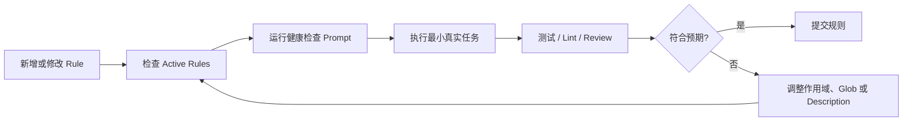

# Cursor Rules 工程化配置、验证与团队落地指南

## 1. 为什么要制定 Cursor Rule 标准

很多人使用 Cursor 写代码时，会遇到一些典型问题：

- 明明说了“不要大改架构”，Agent 还是重构一大片。
- 明明项目使用 `pnpm`，它却给出 `npm` 命令。
- 明明后端接口有统一返回格式，它每次都重新设计一套。
- 明明团队有代码风格，它只在当前对话中记得，换个会话又忘了。

这并不是 Cursor 不够聪明，而是大模型不会天然记住项目中的工程约定。

Cursor Rules 的作用，就是把这些约定转换成长期、可复用、可以按照范围生效的上下文。

> Rule 不是普通 README，而是提供给 Cursor Agent 执行任务时使用的工程约束。

## 2. Cursor Rules 的类型

Cursor 主要有以下几类规则来源：

| 类型 | 位置 | 适用范围 | 推荐程度 |
|---|---|---|---|
| Project Rules | `.cursor/rules/*.mdc` | 当前项目 | 强烈推荐 |
| User Rules | `Cursor Settings > Rules` | 个人所有项目 | 推荐 |
| `AGENTS.md` | 项目根目录或子目录 | Agent 指令和简单规则 | 可选 |
| `.cursorrules` | 项目根目录 | 旧版项目规则 | 不建议新项目使用 |

项目协作优先使用 Project Rules。规则文件可以提交到 Git，让团队成员共享同一套规范。

个人偏好优先使用 User Rules。它只影响个人的 Cursor，不会污染团队项目。

## 3. Rule 的执行机制

Cursor Rules 本质上是一种持久化 Prompt 上下文。

规则生效后，内容会被加入模型上下文，影响 Agent 和 Inline Edit/Cmd-K 的行为。

需要注意：

- Rule 不是编译器规则，不能保证 100% 强制执行。
- Rule 主要影响 Agent 和 Inline Edit/Cmd-K，不应假设它会影响所有补全能力。
- 工程质量仍然需要测试、Lint、Code Review 和 CI 兜底。

因此，规则应该写得具体、简短并且能够验证。

## 4. Project Rules 标准

### 4.1 目录标准

推荐使用以下目录结构：

```text
project-root/
└── .cursor/
    └── rules/
        ├── 00-project-overview.mdc
        ├── 10-workflow.mdc
        ├── 20-code-style.mdc
        ├── 30-frontend.mdc
        ├── 40-backend.mdc
        ├── 50-test.mdc
        └── 90-risk-control.mdc
```

文件名前缀建议：

| 前缀 | 含义 |
|---|---|
| `00-` | 项目总览、始终生效的规则 |
| `10-` | 开发流程、命令和工作方式 |
| `20-` | 通用代码风格 |
| `30-` | 前端规则 |
| `40-` | 后端规则 |
| `50-` | 测试和验证规则 |
| `90-` | 风险控制和禁止事项 |

按照层级拆分文件，可以避免把所有内容塞进一个巨大的规则文件。

### 4.2 MDC 文件结构

Project Rule 使用 `.mdc` 文件，由 Frontmatter 和 Markdown 正文组成。

```md
---
description: 项目通用开发规范，适用于所有 Agent 任务
globs:
alwaysApply: true
---

# 项目通用规则

- 回答和解释使用中文。
- 修改代码前先阅读相关文件，不要凭空猜测项目结构。
- 优先遵循项目现有写法，不要随意引入新框架或抽象。
- 不要执行 `git reset --hard`、`rm -rf` 等破坏性命令。
- 如果需要新增依赖，先说明原因和影响。
```

字段说明：

| 字段 | 说明 |
|---|---|
| `description` | 规则用途；Agent Requested 类型尤其需要写清楚触发场景 |
| `globs` | 文件匹配范围，主要用于 Auto Attached |
| `alwaysApply` | 是否始终加入上下文 |

## 5. Rule 类型怎么选

Cursor Project Rules 支持不同的应用方式。

| 类型 | 适合内容 | 示例 |
|---|---|---|
| Always | 必须始终遵守的项目底线 | 禁止破坏性命令、项目总体边界 |
| Auto Attached | 只对特定文件生效 | `*.tsx` 组件规范、`*.java` 后端规范 |
| Agent Requested | 由 Agent 根据任务选择 | 数据库迁移、发布流程 |
| Manual | 手动点名时生效 | 专项重构、安全审计模板 |

### 5.1 Always：少而硬

Always 规则会持续占用上下文，因此数量一定要少。

适合放入：

- 项目不可违反的底线。
- 基本任务执行流程。
- 禁止事项。
- 项目技术栈概览。

不适合放入：

- 超长业务背景。
- 所有代码细节。
- 每个模块的局部规则。

### 5.2 Auto Attached：按文件类型触发

Auto Attached 适合前端、后端、测试和文档等按照路径区分的规范。

```md
---
description: React 组件开发规范
globs:
  - "src/**/*.tsx"
  - "src/**/*.ts"
alwaysApply: false
---

# React 组件规则

- 组件优先使用函数组件。
- 样式遵循项目已有 Tailwind 写法。
- 不要在组件中直接编写复杂请求逻辑，应抽取到 hooks 或 service。
- 新增可交互组件时，要考虑 loading、error 和 empty 状态。
```

只有当 Agent 引用或修改匹配 Glob 的文件时，这类规则才应该进入上下文。

### 5.3 Agent Requested：依靠 Description 召回

Agent Requested 的关键是 `description`。

描述越明确，Agent 越容易在合适的任务中主动使用。

```md
---
description: 当任务涉及数据库表结构变更、SQL migration 或 schema 更新时使用本规则
globs:
alwaysApply: false
---

# 数据库变更规则

- 所有表结构变更必须提供 migration 文件。
- migration 文件命名格式为 `YYYYMMDDHHmm_description.sql`。
- 新增字段必须说明默认值、是否允许为空及历史数据处理方式。
- 删除字段前必须确认没有代码引用。
- 生产大表变更需要考虑锁表风险。
```

不要只把 Description 写成“数据库规则”，而要明确什么任务会触发规则。

### 5.4 Manual：明确点名才使用

Manual 适合较重或低频的专项流程，例如：

- 生成项目复盘。
- 执行版本发布检查。
- 大规模重构前检查。
- 使用安全审计模板。

使用时需要在聊天中明确 `@ruleName`。

## 6. User Rules 标准

User Rules 是个人规则，配置入口位于 `Cursor Settings > Rules`。

它适合保存个人偏好，不适合保存项目约定。

### 6.1 适合写入 User Rules

```text
请默认使用中文回答。
解释代码时先说结论，再给出关键原因。
修改代码前优先阅读上下文，不要直接猜测。
不要主动进行无关重构。
命令和文件路径使用代码格式展示。
如果不确定，请明确说明不确定点，不要编造。
```

### 6.2 不适合写入 User Rules

以下内容应该放入 Project Rules：

- 某个项目的启动命令。
- 某个项目的数据库表结构。
- 某个项目的接口返回格式。
- 某个团队的分支规范。
- 某个仓库的测试命令。

## 7. 推荐的项目规则模板

### 7.1 项目总览规则

文件：`.cursor/rules/00-project-overview.mdc`

```md
---
description: 项目总览和全局边界，所有任务都必须遵守
globs:
alwaysApply: true
---

# 项目总览

- 本项目是一个 Spring Boot + React 业务系统。
- 后端主要位于 `backend/`，前端主要位于 `frontend/`。
- 后端遵循 controller、service、repository、domain 分层。
- 前端遵循 components、pages、hooks、services 分层。

# 全局约束

- 优先遵循项目现有代码风格。
- 修改前先阅读相关文件，不要生成不存在的 API。
- 不要引入新依赖，除非用户明确同意。
- 不要修改与当前任务无关的文件。
- 不要执行破坏性 Git 或文件命令。
```

### 7.2 工作流规则

文件：`.cursor/rules/10-workflow.mdc`

```md
---
description: 开发工作流、命令执行和任务收尾规范
globs:
alwaysApply: true
---

# 工作流规则

- 接到修改任务后，先定位相关文件，再实施修改。
- 修改前说明将要改动的模块。
- 修改后运行最小必要验证，例如单测、Lint、类型检查或构建。
- 如果无法运行验证，需要说明原因。
- 最终回复包含改动内容、验证结果和剩余风险。

# 命令规范

- 前端优先使用 Lockfile 对应的包管理器。
- 后端优先使用项目现有构建工具，例如 Maven 或 Gradle。
- 不要自动删除用户未要求删除的文件。
```

### 7.3 后端规则

文件：`.cursor/rules/40-backend.mdc`

```md
---
description: 当修改 Java、Spring Boot、Controller、Service、Repository 或测试代码时使用
globs:
  - "backend/**/*.java"
  - "backend/**/*.yml"
  - "backend/**/*.yaml"
alwaysApply: false
---

# 后端开发规则

- Controller 只做参数接收、鉴权入口和响应封装，不写复杂业务逻辑。
- 业务逻辑放在 Service 层。
- Repository 只负责数据访问。
- 新增接口要保持统一返回结构。
- 涉及写操作时要考虑事务边界、幂等和异常处理。
- 不要吞异常，必要时记录关键业务 ID。

# 测试规则

- 新增核心业务逻辑时补充单元测试。
- 修复 Bug 时优先增加一个能够复现问题的测试。
```

### 7.4 前端规则

文件：`.cursor/rules/30-frontend.mdc`

```md
---
description: 当修改 React、TypeScript、页面、组件、hooks 或样式时使用
globs:
  - "frontend/**/*.tsx"
  - "frontend/**/*.ts"
  - "frontend/**/*.css"
alwaysApply: false
---

# 前端开发规则

- 优先复用项目已有组件和 hooks。
- 组件内部不要堆积复杂业务逻辑。
- 请求逻辑放入 services 或 hooks。
- 交互组件要考虑 loading、error、empty 和 disabled 状态。
- 不要使用固定宽度导致移动端溢出。
- 不要引入新的 UI 库，除非用户明确同意。
```

### 7.5 风险控制规则

文件：`.cursor/rules/90-risk-control.mdc`

```md
---
description: 高风险操作控制，涉及删除、迁移、发布、权限、支付或数据修复时必须遵守
globs:
alwaysApply: true
---

# 高风险操作规则

- 不要执行 `git reset --hard`、`git clean -fd`、`rm -rf` 等破坏性命令。
- 不要直接修改生产配置、密钥、支付、权限和数据修复逻辑。
- 涉及数据库迁移时，必须说明回滚方案。
- 涉及权限变更时，必须说明影响范围。
- 不确定时先说明风险，不要强行修改。
```

## 8. 如何检测 Rule 是否生效

不要只依靠“感觉 Agent 遵守了规则”，建议使用以下三层检测。

### 8.1 UI 检查：查看 Active Rules

检查步骤：

1. 打开 Cursor Agent。
2. 发起一个新会话。
3. 查看 Agent 侧边栏中的 Active Rules 或上下文区域。
4. 确认目标规则是否已经加载。

| 规则类型 | 预期表现 |
|---|---|
| Always | 新会话开始时出现 |
| Auto Attached | 引用匹配文件后出现 |
| Agent Requested | Agent 判断任务相关时出现 |
| Manual | 使用 `@ruleName` 后出现 |

如果界面中没有规则，优先检查规则类型、文件路径、Glob 和 Description。

### 8.2 使用探针 Prompt 测试 Always

创建临时规则：`.cursor/rules/00-rule-health-check.mdc`

```md
---
description: Rule 生效健康检查，仅用于测试
globs:
alwaysApply: true
---

# Rule 健康检查

当用户输入 `RULE_HEALTH_CHECK` 时，只回复：

PROJECT_RULE_OK
```

然后在 Cursor Agent 中输入：

```text
RULE_HEALTH_CHECK
```

预期输出：

```text
PROJECT_RULE_OK
```

测试完成后建议删除临时规则，避免污染正常会话。

### 8.3 测试 User Rules

在 User Rules 中临时增加：

```text
当用户输入 USER_RULE_HEALTH_CHECK 时，只回复 USER_RULE_OK。
```

然后在任意项目的 Agent 中输入：

```text
USER_RULE_HEALTH_CHECK
```

预期输出：

```text
USER_RULE_OK
```

如果没有生效，检查：

- User Rules 是否保存成功。
- 是否已经新建 Agent 会话。
- 是否与 Project Rules 冲突。
- 是否被更高优先级的对话指令覆盖。

### 8.4 测试 Auto Attached

创建测试规则：`.cursor/rules/test-ts-rule.mdc`

```md
---
description: TypeScript 文件规则生效测试
globs:
  - "src/**/*.ts"
alwaysApply: false
---

# TypeScript 测试规则

当用户询问 `TS_RULE_HEALTH_CHECK`，并且上下文中引用了 `src/**/*.ts` 文件时，只回复：

TS_RULE_OK
```

测试步骤：

1. 找到一个匹配的文件，例如 `src/index.ts`。
2. 在 Agent 中引用：`@src/index.ts`。
3. 输入 `TS_RULE_HEALTH_CHECK`。
4. 确认输出为 `TS_RULE_OK`。

如果没有生效，优先检查：

- 文件路径是否匹配 `globs`。
- 是否在对话中引用了匹配文件。
- 规则是否位于 `.cursor/rules/`。
- 是否需要重新打开项目或新建会话。

### 8.5 测试 Agent Requested

Agent Requested 依赖 Description，测试任务需要与描述高度相关。

```md
---
description: 当任务涉及数据库 migration、建表、加字段或 SQL schema 变更时使用
globs:
alwaysApply: false
---

# 数据库规则测试

当用户要求设计数据库 migration 时，必须先输出：

DB_RULE_ACTIVE
```

测试 Prompt：

```text
我要给 user 表新增 nickname 字段，请帮我写 migration，并说明注意事项。
```

如果输出包含 `DB_RULE_ACTIVE`，说明规则大概率被 Agent 召回。

如果触发不稳定，可以将关键规则改为 Auto Attached 或 Manual，不要把强依赖规范完全寄托在 Agent Requested 上。

## 9. Rule 不生效时怎样排查

### 9.1 排查清单

| 问题 | 检查点 |
|---|---|
| 规则完全不加载 | 是否位于 `.cursor/rules/*.mdc` |
| Always 不加载 | `alwaysApply` 是否为 `true` |
| Auto Attached 不加载 | `globs` 是否匹配引用的文件 |
| Agent Requested 不加载 | `description` 是否明确描述触发场景 |
| Manual 不加载 | 是否在对话中明确使用 `@ruleName` |
| User Rules 不加载 | 是否保存到 `Cursor Settings > Rules` |
| 旧规则仍有影响 | 是否仍存在 `.cursorrules` 或 `AGENTS.md` |
| 行为不稳定 | 规则是否太长、太泛或互相冲突 |

### 9.2 常见错误

#### 错误一：规则太空泛

```md
---
description: 项目规则
alwaysApply: true
---

写代码要优雅，要高质量，要考虑扩展性。
```

这种规则没有明确可执行动作。

更好的写法：

```md
---
description: 项目通用编码约束
alwaysApply: true
---

- 修改代码前先阅读相关文件。
- 不要引入新依赖，除非用户明确同意。
- 不要重构与当前任务无关的模块。
- 新增核心业务逻辑时补充测试。
```

#### 错误二：所有规则都设置为 Always

这样会造成上下文污染，Agent 每次都携带大量无关规则，反而容易忽略重点。

建议：

- 项目底线使用 Always。
- 文件类型规范使用 Auto Attached。
- 低频专项流程使用 Manual。
- 场景型规则使用 Agent Requested。

#### 错误三：把个人偏好写入项目规则

例如“每次回答都叫我老板”属于个人偏好，应该写入 User Rules，不应提交到团队仓库。

## 10. Rule 的优先级和冲突处理

实际使用中，规则可能来自多个位置。

| 冲突类型 | 处理标准 |
|---|---|
| User Rules 与 Project Rules | 涉及项目工程规范时，Project Rules 优先 |
| Always 与 Auto Attached | Always 保存底线，Auto Attached 保存局部细节 |
| 新规则与旧 `.cursorrules` | 迁移完成后删除旧规则 |
| 当前 Prompt 与 Rule | 明确任务可以临时覆盖普通规则，但要说明冲突 |

建议在项目总览规则中明确：

```text
如果当前请求与 Project Rules 冲突，先指出冲突点，再确认是否临时覆盖。
如果 User Rules 与 Project Rules 冲突，涉及项目代码、命令和架构时优先遵守 Project Rules。
```

安全、权限和破坏性操作等底线，不应该被普通任务 Prompt 随意覆盖。

## 11. 团队落地标准

### 11.1 Rule 评审标准

新增项目规则时，至少回答以下问题：

| 问题 | 说明 |
|---|---|
| 这条规则解决什么重复问题？ | 不要为一次性偏好创建规则 |
| 应该 Always 还是按文件触发？ | 控制上下文成本 |
| 是否能够验证？ | 最好能通过测试、Lint 或探针验证 |
| 是否与已有规则冲突？ | 避免规则互相打架 |

### 11.2 Rule 维护流程

规则不是越多越好。建议每个迭代或每月清理一次：

- 删除过期的技术栈说明。
- 合并重复规则。
- 拆分过长规则。
- 更新测试命令和构建命令。

### 11.3 推荐团队最小规则集

普通项目最少可以包含：

```text
.cursor/rules/
├── 00-project-overview.mdc
├── 10-workflow.mdc
├── 20-code-style.mdc
├── 50-test-and-verify.mdc
└── 90-risk-control.mdc
```

前后端分离项目可以增加：

```text
.cursor/rules/
├── 30-frontend.mdc
└── 40-backend.mdc
```

Monorepo 可以在子目录中放置嵌套规则：

```text
project/
├── .cursor/rules/
│   └── 00-project-overview.mdc
├── apps/web/.cursor/rules/
│   └── frontend-web.mdc
└── services/order/.cursor/rules/
    └── order-service.mdc
```

嵌套规则适合大型仓库，可以避免根目录规则过长。

## 12. 实战 Prompt：让 Cursor 生成 Rule

可以直接在 Cursor 中使用以下 Prompt：

```text
请根据当前项目结构，为我生成一套 Cursor Project Rules。

要求：
1. 使用 `.cursor/rules/*.mdc` 格式。
2. 拆成 5 个文件：项目总览、工作流、代码风格、测试验证、风险控制。
3. 每个规则都要有 description、globs、alwaysApply。
4. Always 规则只放项目底线，不要塞入过多细节。
5. 按文件类型触发的规则使用 globs。
6. 生成后说明每条规则的触发方式和验证方法。
```

如果已经在当前会话中确认了很多项目约定，可以使用：

```text
把我们这次对话中已经确定的项目约定整理成 Cursor Rules。

要求拆分为多个 `.mdc` 文件，不要生成一个大文件。
每条规则必须具体、可执行、可验证。
```

## 13. 可复用的生效检测流程

团队可以把以下流程写入项目 README。

每次新增规则后做三件事：

1. 查看 Agent 侧边栏中的 Active Rules。
2. 使用探针 Prompt 验证规则是否加载。
3. 执行一个最小真实任务，检查行为是否符合预期。



## 14. 最佳实践总结

### 14.1 编写 Rule 的原则

- **短**：一条规则解决一类问题。
- **准**：明确规则在什么场景触发。
- **实**：写具体动作，不写口号。
- **可验**：能够通过探针、测试或行为观察验证。
- **可维护**：不要把规则写成无人敢修改的大文档。

### 14.2 项目规则应该写什么

- 技术栈和目录结构。
- 分层架构。
- 构建、测试和 Lint 命令。
- API、组件、数据库和测试规范。
- 风险操作边界。
- 团队约定和工作流。

### 14.3 个人规则应该写什么

- 回答语言。
- 解释风格。
- 沟通偏好。
- 是否先给结论。
- 是否保持简洁。

### 14.4 不要把 Rule 当成银弹

Rule 不能替代：

- 单元测试。
- 类型检查。
- Lint。
- Code Review。
- CI。
- 权限控制。

Rule 负责让 Agent 更理解项目，工程质量仍然需要自动化验证和团队流程兜底。