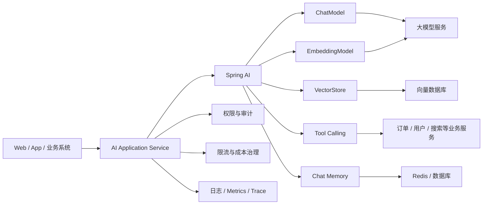
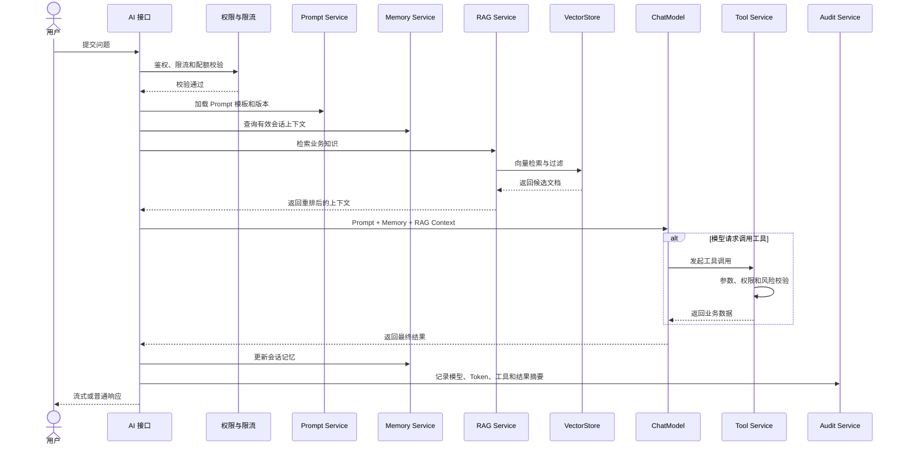
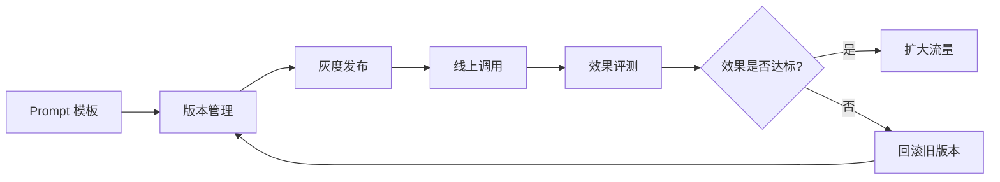
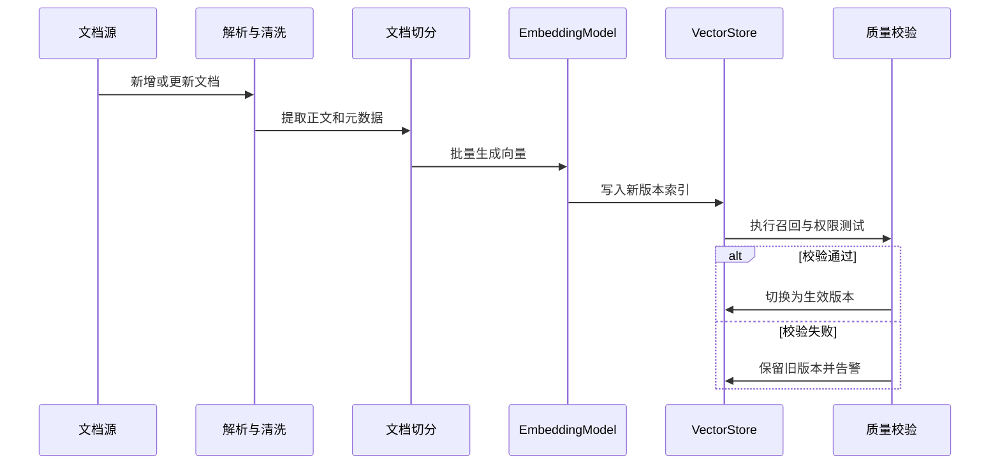
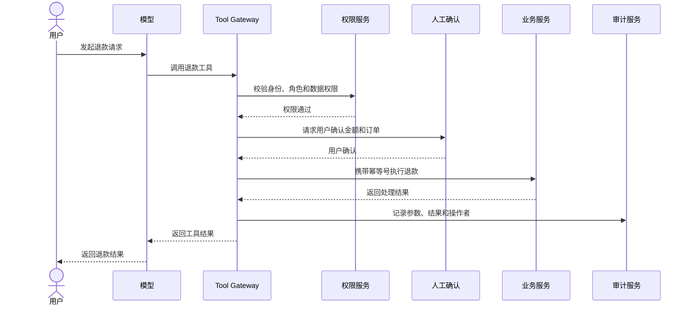
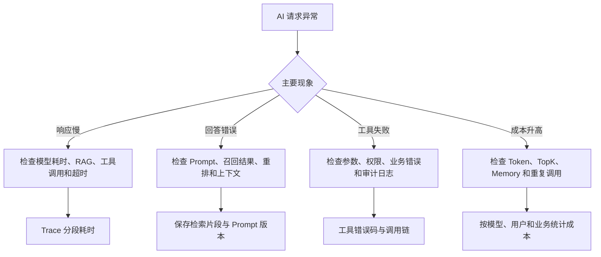

# Spring AI 企业级应用架构与工程治理

## 1. 项目场景：为什么企业接入 AI，难点从来不是“调通接口”

如果只是开发一个简单 Demo，Spring AI 看起来只是：

```text
把模型接入 Spring Boot
```

但进入真实项目后，问题很快会变成：

- Prompt 怎样管理和版本化？
- 模型怎样切换？
- 不同模型的成本和效果怎样取舍？
- RAG 的知识更新链路怎样建设？
- 工具调用怎样进行权限控制和审计？
- 会话记忆怎样保存和截断？
- 超时、重试、限流和降级怎样处理？
- 日志、Trace 和成本统计怎样接入？
- AI 结果怎样纳入团队工程体系？

因此，从工程角度看 Spring AI，重点不是“能不能调用模型”，而是：

> 它能否帮助团队把 AI 能力建设成可维护、可治理、可以接入真实业务的后端组件体系。

## 2. 架构位置：Spring AI 在企业系统中负责什么

Spring AI 在大型 Java 项目中的角色，更接近 AI 能力的工程接入层。



这张图需要关注三个结论：

- Spring AI 本身不是模型。
- 它负责组织模型、向量库、工具、记忆与业务服务。
- 生产系统是否稳定，主要取决于这一层的工程组织和治理能力。

## 3. 一句话定位 Spring AI

Spring AI 是一套面向 Java 和 Spring 生态的 AI 应用开发抽象，用于统一组织模型调用、Prompt、Embedding、RAG、Tool Calling、Memory 及相关工程治理能力。

换句话说，它解决的不只是“接入一个模型 API”，而是：

> AI 能力怎样进入 Spring 项目的分层、治理和交付体系。

## 4. 一次完整 AI 请求不只是模型调用

生产环境中的 AI 请求通常由多个组件共同完成。



一个完整请求可能涉及权限、Prompt、记忆、知识检索、模型推理、工具调用、审计和成本统计，而不是简单地“问模型一句话”。

## 5. Spring AI 最重要的价值是统一抽象

很多人第一次接触 Spring AI 时，只注意到 `ChatClient`。

但它真正有价值的地方，是统一了以下核心概念：

- `ChatModel`
- `Prompt`
- `EmbeddingModel`
- `VectorStore`
- Tool Calling
- Chat Memory

这意味着团队不需要每接入一个模型或新增一种 AI 能力，就重新设计一套调用结构。

统一抽象可以降低：

- 模型切换成本。
- 重复封装数量。
- 不同模块的接入差异。
- 后续维护和治理难度。

## 6. Prompt 管理：不要让 Prompt 散落在业务代码中

Prompt 是 AI 项目最容易失控的部分之一。

### 6.1 常见问题

- Prompt 写死在 Controller。
- 不同方法复制相似的提示词。
- 没有版本概念。
- 线上效果变化无法追踪。
- Prompt 修改后无法快速回滚。

### 6.2 更合理的管理方式

Prompt 应该作为独立资产管理：

- 系统 Prompt。
- 业务 Prompt 模板。
- 变量占位。
- 版本号。
- 模型参数。
- 灰度开关。
- 生效时间。
- 评测结果。



在 AI 项目中，Prompt 已经接近“配置 + 策略”，不能只把它当成普通字符串。

## 7. RAG：真正的难点是检索质量

接入一个 `VectorStore` 并不代表 RAG 已经可用。

真正影响效果的因素包括：

- 文档切分过细或过粗。
- 文档本身质量不高。
- Embedding 模型不适合当前领域。
- TopK 配置不合理。
- 检索结果包含大量噪声。
- 缺少元数据过滤和权限过滤。
- 文档更新后没有及时重建索引。
- 没有要求模型基于上下文回答。

RAG 质量不稳定时，根因通常不仅是模型，还可能来自：

```text
文档质量
-> 切分策略
-> 向量化
-> 召回
-> 过滤
-> 重排
-> Prompt 组装
-> 答案生成
```

### 7.1 知识更新链路



生产系统需要把知识更新当成数据发布流程，而不是简单地向向量库追加数据。

## 8. Tool Calling：连接真实业务系统的关键

如果用户询问：

```text
帮我查询订单 1001 的物流状态。
```

模型不能凭空回答，需要调用真实业务工具。

Tool Calling 是 AI 连接订单、用户、库存和搜索等业务系统的重要方式。

### 8.1 工具设计原则

#### 工具要小而清晰

不要设计一个拥有大量可选参数的万能工具。一个工具应该完成一个明确动作。

#### 参数必须严格校验

模型生成的参数仍然属于外部输入，不能天然信任。

#### 写操作必须谨慎

查询订单可以自动执行，但退款、修改状态、发券和删除数据等操作需要更严格的权限和确认。

#### 必须保留审计记录

至少记录：

- 谁发起了请求。
- 调用了哪个工具。
- 传入了哪些参数。
- 工具返回了什么结果。
- 是否涉及敏感或高风险操作。

### 8.2 高风险工具调用流程



安全边界不能依赖“模型自己懂事”，必须由业务系统强制执行。

## 9. Memory：多轮对话不是无限拼接历史

Chat Memory 很有价值，但也容易带来新的问题：

- 会话历史持续增长。
- Token 成本越来越高。
- 旧信息污染新回答。
- 过期信息继续影响判断。
- 敏感信息被长期保存。

更稳妥的做法包括：

- 限制保留轮数。
- 按 Token 数量截断历史。
- 对长期对话生成摘要。
- 区分短期记忆和长期记忆。
- 为记忆设置过期时间。
- 敏感数据不直接写入记忆。
- 用户可以查看和删除自己的记忆。

> Memory 不是越多越好，而是保留的信息越有用越好。

## 10. 推荐的工程分层

生产项目不应该把全部 AI 逻辑写入 Controller，也不建议创建一个万能 `AIService`。

可以按照职责拆分：

| 组件 | 主要职责 |
|---|---|
| AI Application Service | 业务用例编排和返回结果组装 |
| Prompt Service | Prompt 模板、变量、版本和灰度管理 |
| Chat Service | 模型选择、调用参数和响应处理 |
| RAG Service | 检索、过滤、重排和上下文组装 |
| Tool Service | 工具注册、参数校验、权限和执行 |
| Memory Service | 会话历史、摘要、截断和过期 |
| Audit Service | Token、模型、工具调用和风险审计 |

这类分层的目标不是增加类的数量，而是避免 Prompt、检索、工具和业务编排互相耦合。

## 11. 生产问题一：模型可以调用，但工程结构越来越乱

### 11.1 常见表现

- Prompt 到处散落。
- 工具定义不统一。
- RAG 逻辑在多个模块重复。
- 不同模块各自封装模型调用。
- 更换模型时需要修改大量业务代码。

### 11.2 治理思路

- 建立统一 AI 应用层。
- 集中管理 Prompt 和模型配置。
- 将检索、工具、记忆和审计能力组件化。
- 通过统一接口隔离具体模型提供方。
- 禁止 Controller 直接组织复杂 AI 调用链路。

## 12. 生产问题二：成本和延迟失控

### 12.1 常见原因

- Prompt 太长。
- RAG 返回片段过多。
- 多轮记忆无限增长。
- 同一个请求重复调用模型。
- Tool Calling 链路过长。
- 没有限流和结果缓存。
- 所有请求都使用高成本模型。

### 12.2 成本治理

- 控制上下文长度。
- 调整 RAG TopK。
- 压缩 Prompt 和文档片段。
- 缓存稳定问题的结果。
- 按任务复杂度选择不同模型。
- 记录输入、输出和总 Token。
- 按用户、租户和业务统计成本。

### 12.3 延迟治理

- 设置模型调用超时。
- 限制工具调用轮次。
- 为外部工具设置独立超时。
- 异步处理非核心链路。
- 使用流式输出改善用户体验。
- 对弱实时场景提供降级结果。

## 13. 生产问题三：安全和权限边界不清

### 13.1 典型风险

- 模型调用高风险工具。
- Prompt 注入改变工具行为。
- 用户查询无权访问的数据。
- 敏感字段没有脱敏。
- 日志记录了隐私内容。
- 测试环境工具错误连接生产服务。

### 13.2 治理措施

- 工具权限分级。
- 数据权限二次校验。
- 高风险操作人工确认。
- 敏感数据脱敏。
- Prompt 注入检测和指令隔离。
- 模型与工具调用审计。
- 测试、预发和生产环境隔离。
- 写操作增加幂等和回滚机制。

Spring AI 可以组织这些能力，但安全边界必须由业务系统和基础设施强制保证。

## 14. Spring AI 与直接 SDK、HTTP 封装怎样取舍

| 方案 | 优点 | 缺点 | 适合场景 |
|---|---|---|---|
| 直接 HTTP 或 SDK | 轻量、上手快 | 容易散乱，长期维护成本高 | Demo、小工具、PoC |
| Spring AI | 抽象统一、与 Spring 体系融合 | 需要理解框架抽象 | 中长期 Java AI 项目 |
| 企业 AI 平台 | 治理、评测和多租户能力更完整 | 建设和接入成本高 | 多团队、平台化建设 |

如果只是一次性功能、临时脚本或 Demo，直接使用 SDK 也可以。

如果项目需要以下能力，Spring AI 的价值会更加明显：

- RAG。
- Tool Calling。
- Chat Memory。
- 多模型切换。
- 统一 Prompt 管理。
- 统一监控和成本治理。

## 15. 线上怎样排查 Spring AI 项目问题

排查时首先要区分：

- 模型响应慢。
- 检索结果不准确。
- 工具执行失败。
- Prompt 设计不合理。
- Memory 污染上下文。
- Token 和成本异常增长。



### 15.1 建议记录的指标

- 模型调用次数、成功率和耗时。
- 首 Token 延迟和完整响应时间。
- 输入、输出和总 Token。
- RAG 召回数量、重排耗时和引用命中率。
- 工具调用次数、成功率、耗时和拒绝次数。
- Memory 长度和摘要次数。
- 用户、租户和业务维度成本。
- 超时、限流和降级次数。

### 15.2 建议保留的日志和 Trace

- Prompt 模板版本，不建议直接记录全部敏感内容。
- 模型名称和主要调用参数。
- 检索文档 ID、得分和版本。
- 工具名称、脱敏参数和错误码。
- 每个阶段的 Trace Span。
- 最终响应状态和风险标签。

## 16. 稳定性治理

| 风险 | 治理方案 |
|---|---|
| 模型超时 | 设置超时、取消请求、降级回复 |
| 模型限流 | 本地限流、租户配额、排队和降级模型 |
| 模型不可用 | 多模型路由、熔断和备用提供方 |
| RAG 无结果 | 允许明确回答“不知道”，避免脱离上下文生成 |
| 向量库异常 | 超时、只使用基础模型或返回知识库不可用提示 |
| 工具调用失败 | 限制重试、保证幂等、返回可解释错误 |
| Memory 过长 | 滑动窗口、摘要和 Token 上限 |
| 成本异常 | 预算告警、Token 配额和高成本模型审批 |
| 敏感信息泄漏 | 输入输出脱敏、权限过滤和审计 |

模型调用具有耗时长、成本高和结果不确定的特点，因此不能完全照搬普通 CRUD 接口的治理方式。

## 17. 面试怎么说

### 17.1 30 秒回答

> Spring AI 是 Spring 生态中的 AI 应用开发框架。它的核心价值不是简单调用模型接口，而是统一抽象 Chat、Prompt、Embedding、VectorStore、Tool Calling 和 Chat Memory，让 Java 后端可以更规范地构建 RAG、会话和业务工具调用能力。生产落地时，我会重点关注 Prompt 管理、RAG 检索质量、工具权限、安全审计、成本控制和可观测性。

### 17.2 2 分钟展开

> 如果只是简单 Demo，直接调用模型 SDK 就能完成。但真实项目的难点会从“能不能调通”变成“怎样把 AI 能力工程化”。Spring AI 把模型、Prompt、Embedding、向量检索、工具调用和会话记忆做了统一抽象，可以让这些能力自然进入 Spring Boot 项目的分层体系。
>
> 我会重点关注四个方面。第一是 Prompt 管理，因为 Prompt 本质上属于策略资产，需要版本、灰度和回滚。第二是 RAG，接入向量库只是开始，文档质量、切分、召回、重排和知识更新链路共同决定最终效果。第三是 Tool Calling，这是 AI 连接业务系统的位置，也是权限和审计风险最大的地方。第四是工程治理，包括超时、限流、模型路由、Token 成本、日志、Trace 和降级。
>
> Spring AI 不会自动解决业务和安全问题，但它可以提供统一的工程结构，让 Java 团队更容易建设和维护中长期 AI 应用。

### 17.3 面试官深挖

#### Spring AI 最大的价值是什么？

最大的价值是统一抽象和工程组织能力。它不仅让模型调用更方便，还能让 Chat、RAG、Tool 和 Memory 在同一套 Spring 风格下协作。

#### RAG 最大的难点是什么？

不是能否接入向量数据库，而是检索质量和知识更新。文档质量、切分、Embedding、召回、过滤、重排和 Prompt 组装都会影响结果。

#### Tool Calling 最大的风险是什么？

权限边界。模型生成的工具参数不能天然信任，高风险写操作必须经过权限校验、人工确认、幂等控制和审计。

#### Memory 应该怎样控制？

使用滑动窗口、Token 上限和摘要记忆，区分短期与长期记忆，并避免敏感信息长期保存。

#### 模型调用超时怎样处理？

设置明确超时和取消机制，根据业务场景返回降级结果；如果有多模型路由，可以在满足幂等和成本要求时切换备用模型。

#### 怎样控制 AI 成本？

记录 Token 使用，控制 Prompt、TopK 和 Memory 长度；按任务复杂度选择模型，并设置用户、租户和业务维度配额与告警。

#### 什么时候不一定需要 Spring AI？

一次性 PoC、小脚本或非常轻量的模型调用可以直接使用 SDK。Spring AI 更适合需要 RAG、Tool、Memory、多模型和统一治理的中长期 Java 项目。

## 18. 总结

Spring AI 真正有价值的地方，不是帮助开发人员完成一次模型调用，而是：

- 统一 AI 能力抽象。
- 将 Prompt、RAG、Tool 和 Memory 工程化。
- 让 AI 能力进入 Spring 项目的分层和治理体系。
- 帮助 Java 后端团队更稳定地建设 AI 应用。

有经验地介绍 Spring AI，重点应该放在：

- 它在架构中的位置。
- 它解决了哪些工程问题。
- 它与直接 SDK 的区别。
- 它在 RAG、Tool Calling 和 Memory 中的作用。
- 项目上线后怎样治理成本、稳定性和安全风险。

一句话总结：

> Spring AI 的核心价值不是“调用模型更方便”，而是让大模型能力真正进入 Java 后端项目的工程体系。
