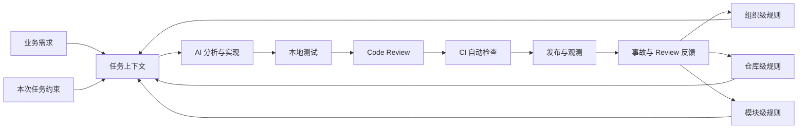
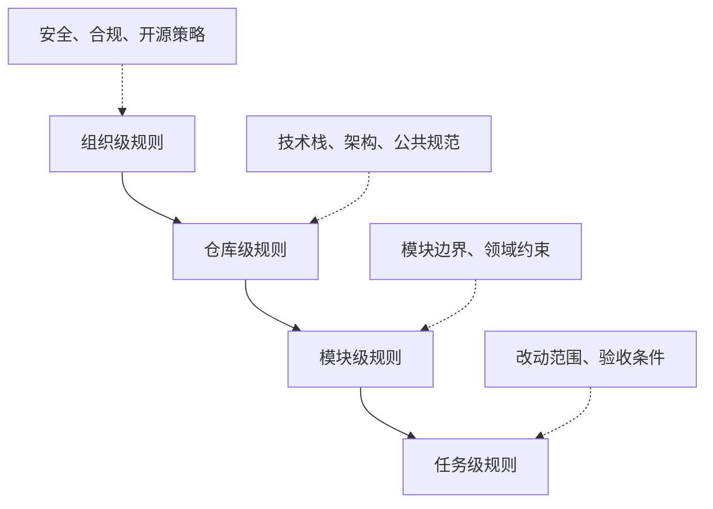
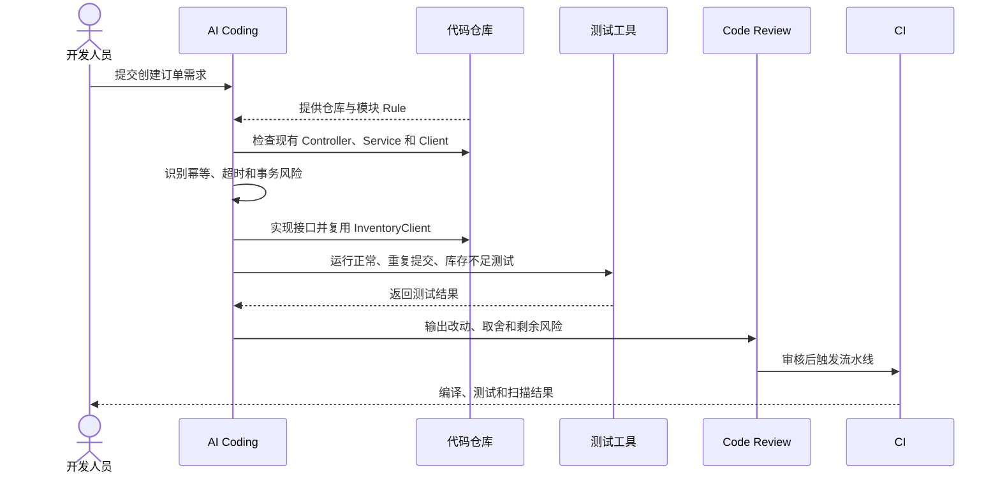
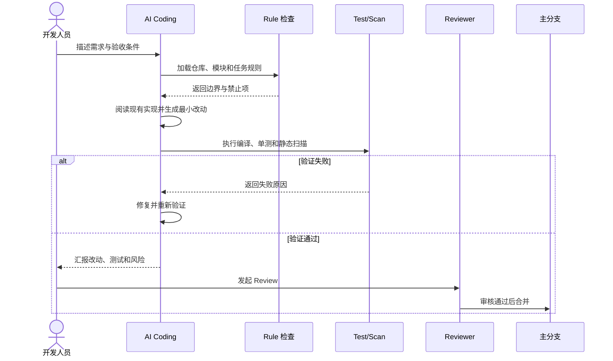
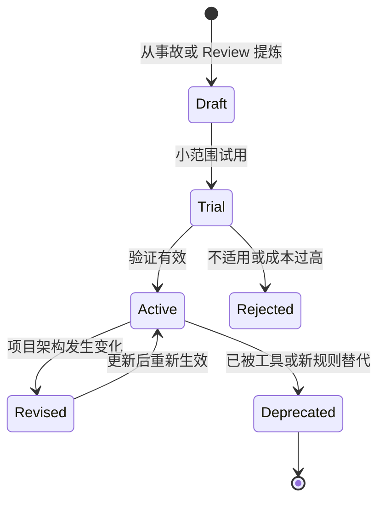

# 从代码生成到工程治理：大型项目 AI Coding Rule 体系设计与落地

## 1. 为什么 AI Coding 最终会走向工程治理

AI 可以快速生成接口、SQL、测试和配置，但“能够生成代码”不等于“能够稳定交付代码”。

在大型 Java 项目中，如果只给 AI 一段需求，让它按照通用经验自由实现，短期开发速度可能提升，长期却容易出现：

- Controller、Service、Mapper 职责逐渐混乱。
- 同一种能力出现多套工具类和封装。
- 事务、幂等、权限和数据一致性被遗漏。
- Redis、MQ、线程池等基础设施使用方式不统一。
- 测试、日志、监控和异常处理质量不稳定。
- AI 生成的代码可以运行，却无法顺利通过团队 Review。

问题的根源不是 AI 不会写代码，而是它不知道当前项目已经形成的隐含约束。

这些约束可能散落在老代码、团队经验、事故复盘、Review 意见和发布流程中。如果不把它们显式表达出来，AI 只能根据通用模式猜测。

因此，大型项目引入 AI Coding 后，需要解决的核心问题会从“怎样生成更多代码”转向：

> 怎样让 AI 在正确的架构边界内，按照团队标准生成可以验证、可以审查、可以交付的代码。

这就是 AI Coding Rule 的价值。

## 2. 一句话定位 Rule

在 AI Coding 场景中，Rule 是团队为了约束 AI 的工程边界、实现方式和交付标准，而沉淀的一组结构化、可执行、可验证的开发规则。

Rule 主要回答三个问题：

1. AI 应该按照什么标准实现需求？
2. 哪些架构边界和危险操作不能突破？
3. 生成结果怎样通过测试、Review 和 CI 进入正常交付流程？

Rule 不是一句“请生成高质量代码”，而是具体到项目的工程约束，例如：

```text
Controller 只负责参数接收、权限校验和返回封装。
业务编排和事务边界必须放在 Service。
所有写接口必须说明幂等策略。
服务间调用统一复用现有 Feign Client。
修复缺陷时必须增加可以复现问题的回归测试。
```

## 3. Rule 在 AI Coding 架构中的位置

Rule 不是代码生成后的补充检查，而应该在需求进入 AI 时就参与决策，并贯穿整个交付过程。



这套流程的重点是：

- 生成前，用 Rule 限制实现空间。
- 生成中，让 AI 主动解释取舍和风险。
- 生成后，通过测试、Review 和 CI 验证 Rule。
- 上线后，根据事故和反馈持续修正规则。

Rule 的最终目标不是增加文档，而是形成可持续迭代的工程治理闭环。

## 4. Rule 与其他工程机制的关系

Rule 不能替代测试、静态扫描和 Code Review。

| 机制 | 主要作用 | 擅长解决的问题 |
|---|---|---|
| Rule | 在生成前约束 AI 的决策 | 分层、边界、实现方式、交付要求 |
| 单元测试 | 验证代码行为 | 正常流程、异常流程、回归问题 |
| 静态扫描 | 自动发现代码问题 | 格式、潜在缺陷、安全风险 |
| Code Review | 判断设计是否合理 | 业务正确性、架构取舍、可维护性 |
| CI/CD | 阻止不合格变更进入主干 | 编译、测试、扫描、发布门禁 |
| 监控告警 | 验证上线后的真实表现 | 错误率、延迟、资源和业务指标 |

Rule 负责告诉 AI“应该怎么做”，自动化工具负责验证“有没有做到”，人工 Review 负责判断“这样做是否真的合理”。

## 5. Rule 的作用域和优先级

大型项目不能把所有规则塞进同一个文件。规则应按照作用域分层，越接近当前任务的规则越具体。



### 5.1 组织级规则

适用于多个项目，通常包含：

- 密钥和敏感数据管理。
- 开源许可证和依赖引入要求。
- 数据安全、权限和审计要求。
- 生产变更与发布审批规则。

### 5.2 仓库级规则

描述当前项目的长期基线：

- 使用的技术栈和版本边界。
- 模块结构和依赖方向。
- 统一异常、日志和返回结构。
- Redis、MQ、数据库和服务调用方式。
- 测试命令、构建命令和交付要求。

### 5.3 模块级规则

描述某个业务模块的特殊约束：

- 订单状态只能通过领域服务修改。
- 支付回调必须经过签名验证。
- 库存扣减必须携带幂等号。
- 用户模块不能直接依赖营销模块实现。

### 5.4 任务级规则

只对本次改动生效：

```text
只允许修改 order 模块。
必须复用现有 InventoryClient。
不要修改数据库表结构。
补充库存不足和重复提交测试。
保持现有接口响应结构兼容。
```

### 5.5 规则冲突怎样处理

建议明确以下优先级：

```text
安全与合规规则
> 明确的任务验收条件
> 模块规则
> 仓库通用规则
> 通用编码偏好
```

但任务级规则不能绕过安全、权限和数据保护底线。

当规则冲突或无法同时满足时，AI 不应该自行选择风险更大的方案，而应该：

1. 指出发生冲突的规则。
2. 说明各方案影响。
3. 优先采取范围更小、可回滚的实现。
4. 无法安全判断时请求人工确认。

## 6. Rule 应该覆盖哪些层次

对于 Spring Boot 微服务项目，可以先建立下面六类规则。

### 6.1 架构与分层规则

这类规则负责保护模块边界。

```text
Controller 只做参数接收、权限校验和返回封装。
Service 负责业务编排和事务边界。
Mapper 只负责数据访问，不能包含业务状态判断。
Web 层禁止直接调用 Mapper。
禁止跨模块直接依赖对方内部实现。
新增逻辑优先复用已有领域服务。
```

分层规则不能机械化。例如，简单健康检查没有必要强制创建空 Service；真正需要限制的是复杂业务逻辑和事务进入 Controller。

### 6.2 编码与可维护性规则

```text
DTO、Command、VO 和 Entity 必须明确区分。
优先复用现有组件，不新增重复工具类。
新增抽象必须能够减少真实复杂度或重复。
公共方法命名必须表达业务含义。
复杂分支应拆分为可独立测试的业务方法。
```

“单个方法不能超过 80 行”可以作为提醒，但不适合作为绝对正确的设计标准。Rule 应关注复杂度，而不是只关注行数。

### 6.3 中间件与基础设施规则

```text
服务间 HTTP 调用统一使用项目现有 Client。
禁止在业务代码中直接创建无管理线程。
异步任务统一使用有界线程池。
MQ 消费必须考虑重复投递和消费幂等。
Redis Key 必须使用统一业务前缀和过期策略。
分布式锁必须说明锁粒度、超时和释放方式。
外部调用必须设置连接和读取超时。
```

这类规则可以防止 AI 为了完成局部需求，顺手引入新的 HTTP 客户端、JSON 组件或线程模型。

### 6.4 数据与事务规则

```text
所有写接口必须说明幂等策略。
跨服务调用不能长期占用本地数据库事务。
禁止无 WHERE 条件的 UPDATE 和 DELETE。
列表接口默认分页并设置最大页大小。
新增查询需要检查索引和预期数据量。
事务中禁止执行不可控的长耗时操作。
```

事务规则应同时说明一致性边界。不能只写“加事务”，还要解释数据库操作、远程调用和消息发送之间如何协调。

### 6.5 安全规则

```text
所有外部输入必须显式校验。
敏感字段禁止明文写入日志。
密钥必须通过环境变量或配置中心注入。
SQL 必须参数化，禁止拼接外部输入。
文件上传必须校验类型、大小和存储路径。
对外 URL 必须考虑 SSRF 和重定向风险。
高权限操作必须保留审计记录。
```

安全规则应该拥有最高优先级，不能被“为了快速实现”之类的任务要求覆盖。

### 6.6 测试与交付规则

```text
新增业务逻辑必须覆盖正常和主要异常路径。
修复缺陷必须增加能够复现问题的回归测试。
涉及核心链路时必须说明监控和告警指标。
修改接口或消息结构时必须评估兼容性。
交付时必须说明改动内容、验证结果和剩余风险。
```

## 7. 怎样写出 AI 真能执行的 Rule

### 7.1 抽象规则为什么容易失效

下面这些规则几乎无法验证：

```text
请写高质量代码。
请注意安全。
请遵循最佳实践。
请保证系统稳定。
```

它们的问题是没有明确行为、适用范围和验收方式。

### 7.2 推荐规则结构

每条关键规则至少包含：

| 字段 | 说明 |
|---|---|
| 规则名称 | 规则解决什么问题 |
| 适用范围 | 哪些模块、文件或任务适用 |
| 规则内容 | 必须做什么或禁止做什么 |
| 原因 | 对应的工程风险 |
| 正例 | 推荐实现 |
| 反例 | 明确禁止的实现 |
| 例外 | 哪些场景可以不遵守 |
| 验证方式 | Review、测试还是 CI 检查 |

示例：

```yaml
name: Controller 不承载业务逻辑
scope: 所有 Web 接口
rule: Controller 只负责参数接收、校验、鉴权和结果封装
reason: 避免业务逻辑与协议层耦合，降低复用和测试成本
forbidden:
  - Controller 直接调用 Mapper
  - Controller 开启事务并更新多个聚合
exceptions:
  - 无业务逻辑的健康检查接口
verification:
  - Code Review
  - 架构依赖测试
```

### 7.3 Rule 要少而硬

第一版不建议直接整理上百条规则。

更有效的顺序是先沉淀 15～30 条高风险规则，优先覆盖：

- 分层与模块边界。
- 事务和幂等。
- SQL 和数据安全。
- 外部调用超时。
- MQ 重复消费。
- 日志和敏感数据。
- 测试和交付要求。

当这些规则稳定后，再逐步加入性能、可观测性和领域模型约束。

## 8. Java 项目里的完整落地案例

下面用“创建订单并扣减库存”说明 Rule 如何改变 AI 的实现过程。

### 8.1 原始需求

```text
新增创建订单接口。
创建订单时调用库存服务扣减库存。
```

如果没有 Rule，AI 可能直接在 Controller 中：

1. 查询商品。
2. 调用库存服务。
3. 写入订单。
4. 返回结果。

这样的代码可能能运行，但会遗漏重复提交、超时、事务边界和回归测试。

### 8.2 注入项目 Rule

```text
Controller 不写业务逻辑。
订单写接口必须使用 requestId 保证幂等。
库存调用必须复用 InventoryClient。
远程调用不能放在长期数据库事务中。
库存超时不能无限重试。
新增订单逻辑必须覆盖重复提交和库存不足测试。
日志必须携带 traceId 和 orderNo，不能打印用户敏感信息。
```

### 8.3 AI 的实现流程



Rule 让 AI 在写代码前就知道：这个需求不是“增加一个接口”，而是要在现有订单架构内完成一次可靠写入。

### 8.4 典型实现骨架

```java
@PostMapping("/orders")
public Result<OrderVO> create(@Valid @RequestBody CreateOrderRequest request) {
    return Result.success(orderService.create(request));
}
```

```java
public OrderVO create(CreateOrderRequest request) {
    Order existing = orderRepository.findByRequestId(request.getRequestId());
    if (existing != null) {
        return orderConverter.toVO(existing);
    }

    InventoryResult inventory = inventoryClient.deduct(
            request.getRequestId(),
            request.getSkuId(),
            request.getQuantity());

    if (!inventory.isSuccess()) {
        throw new InventoryNotEnoughException(request.getSkuId());
    }

    return createOrderTransaction(request);
}
```

代码只是示意。真实项目还要根据一致性要求选择本地消息表、事务消息、Saga 或补偿机制，不能把远程调用和数据库事务简单包进一个大事务。

### 8.5 Rule 拦截了哪些风险

| 风险 | 对应 Rule |
|---|---|
| Controller 直接编排业务 | 分层规则 |
| 重复请求生成两笔订单 | 写接口幂等规则 |
| 随意新增 HTTP 调用方式 | 基础设施复用规则 |
| 库存超时后无限重试 | 超时与重试规则 |
| 远程调用长期占用事务 | 事务边界规则 |
| 只测试正常流程 | 测试交付规则 |

## 9. Rule 怎样进入日常 AI 工作流

Rule 需要使用不同载体，不能依赖开发人员每次手动复制全部规范。

| 载体 | 适合内容 | 生命周期 |
|---|---|---|
| 仓库规则文件 | 技术栈、架构边界、构建测试命令 | 长期 |
| 模块规则文件 | 订单、支付、用户等领域约束 | 长期 |
| Skill 或工作流模板 | 固定分析、编码、验证流程 | 中长期 |
| 任务 Prompt | 本次需求范围和验收条件 | 单次任务 |
| Review 清单 | 人工判断项 | 持续 |
| CI 规则 | 可以自动验证的硬门禁 | 持续 |

不同 AI Coding 工具的规则文件名称和加载机制可能不同，但治理思路是一致的：

```text
长期稳定约束放仓库
领域约束跟随模块
本次边界写进任务
可自动验证的规则交给 CI
```

## 10. 从生成到交付的执行闭环

下面这张图展示一次受 Rule 约束的代码变更如何进入主干。



AI 在这个流程里不是“代码输出框”，而是需要完成阅读、实现、验证和交付说明的工程协作者。

## 11. 哪些 Rule 应该自动化

Rule 可以分为三类。

### 11.1 可以完全自动验证

- 代码格式。
- 编译结果。
- 单元测试是否通过。
- 覆盖率是否达到门槛。
- 是否存在高危依赖漏洞。
- 是否出现明文密钥。
- 是否执行无条件更新和删除。

这些规则应尽量进入 CI，避免消耗人工 Review。

### 11.2 可以半自动验证

- Controller 是否直接依赖 Mapper。
- 模块依赖方向是否被破坏。
- 新接口是否增加测试。
- 日志是否包含必要上下文。
- 新增依赖是否经过允许。

可以通过架构测试、静态分析或脚本发现大部分问题，再由人工确认。

### 11.3 必须人工判断

- 领域模型是否合理。
- 事务边界是否符合业务一致性。
- 新抽象是否真的有价值。
- 方案是否过度设计。
- 异常处理是否符合用户体验。

不是所有 Rule 都应该被强行转换成机器规则。错误的自动化门禁会诱导团队为通过检查而写代码。

## 12. Rule 的版本与生命周期治理

Rule 也属于工程资产，需要版本管理。



每条重要规则最好记录：

- 创建原因。
- 适用范围。
- 负责人。
- 生效时间。
- 最近更新时间。
- 对应事故或 Review 记录。
- 是否已有自动化检查。

当项目从 MyBatis 切换数据访问方式，或从 Feign 迁移到其他客户端时，旧规则也要同步调整。过期 Rule 会让 AI 生成与现状冲突的代码。

## 13. 生产问题与常见失败方式

### 13.1 规则太抽象

现象：AI 每次都声称遵守了规则，但实现仍然不一致。

原因：规则没有具体行为和验证方式。

改进：增加适用范围、禁止项、正反例和检查方式。

### 13.2 规则太多

现象：AI 忽略后半部分规则，开发人员也无法维护。

原因：把编码手册完整复制成 AI 上下文，没有区分优先级。

改进：保留少量硬规则，按组织、仓库、模块和任务分层加载。

### 13.3 Rule 与项目现状脱节

现象：规则要求使用项目中不存在的组件，AI 被迫新建一套实现。

原因：Rule 来自通用模板，没有先读取仓库。

改进：以真实代码、事故和 Review 高频问题为来源。

### 13.4 只有文档，没有门禁

现象：Rule 写得很好，但不影响代码合并。

原因：没有进入测试、Review 和 CI。

改进：为每条硬规则标注验证方式，并逐步自动化。

### 13.5 规则之间互相冲突

现象：一条规则要求最小改动，另一条要求统一重构。

原因：没有定义作用域、优先级和例外机制。

改进：明确高优先级规则，并要求 AI 暴露冲突和方案影响。

### 13.6 把 Rule 当成绝对真理

现象：为了遵守规则制造无意义分层和抽象。

原因：没有设计例外和废弃机制。

改进：Rule 应保护工程边界，但不能替代工程判断。

## 14. 稳定性与治理指标

Rule 是否有效，不能只看文档数量。

建议关注以下指标：

| 指标 | 说明 |
|---|---|
| 首次 Review 通过率 | AI 变更第一次提交的质量 |
| Review 返工次数 | 规则是否减少重复问题 |
| 回归缺陷数量 | 测试和边界规则是否有效 |
| 重复实现数量 | 复用规则是否发挥作用 |
| 安全问题数量 | 输入、权限、密钥规则是否生效 |
| 规则命中率 | 哪些规则经常触发 |
| 规则误报率 | 哪些规则阻碍正常开发 |
| 自动化覆盖率 | 多少硬规则已进入 CI |

这些指标用于发现趋势，不适合简单变成开发人员绩效。否则团队可能为了追求“高通过率”而减少有价值的 Review。

## 15. 团队怎样逐步推进

### 第一阶段：收住高风险区域

从最近的线上事故和 Review 高频问题中提炼 15～30 条规则，优先覆盖：

- 分层。
- 事务和幂等。
- SQL。
- 安全。
- 外部调用。
- 日志与测试。

### 第二阶段：选择一个模块试点

先在订单、支付或用户等边界清晰的模块试用，观察：

- AI 返工是否减少。
- 测试是否更完整。
- 实现风格是否统一。
- Rule 是否存在误导和冲突。

### 第三阶段：建立 Review 和 CI 闭环

把可以验证的规则逐步转成：

- 架构测试。
- 静态扫描。
- 构建脚本。
- 单元测试。
- CI 门禁。

### 第四阶段：周期性治理

每月或每季度检查：

- 哪些规则从未使用。
- 哪些规则过于抽象。
- 哪些规则误报较多。
- 哪些事故值得沉淀新规则。
- 哪些规则已经可以自动化。

## 16. 方案取舍

| 方案 | 优点 | 缺点 | 适合场景 |
|---|---|---|---|
| 只使用任务 Prompt | 灵活、成本低 | 规则容易遗漏，团队不统一 | 临时任务、小项目 |
| 单一仓库规则文件 | 集中、容易发现 | 文件容易膨胀 | 中小型仓库 |
| 分层 Rule 体系 | 作用域清晰、可维护 | 需要治理成本 | 大型项目、多团队协作 |
| 全部依赖 CI | 执行力强 | 无法覆盖设计判断 | 格式、安全、测试门禁 |
| Rule + Review + CI | 生成前约束，生成后验证 | 建设成本最高 | 核心业务和长期项目 |

大型项目更适合最后一种组合，但应该分阶段建设，而不是一次完成所有规则。

## 17. 面试怎么说

### 17.1 30 秒回答

> 在大型项目里给 AI 定 Rule，本质上是把团队隐含的工程共识显式化，让 AI 在架构、安全、事务、基础设施和交付边界内生成代码。Rule 不能只写成文档，而要按组织、仓库、模块和任务分层，并进入 Prompt、Code Review 和 CI 闭环。这样 AI 才能从随机生成代码，变成可验证、可审查的工程协作方式。

### 17.2 2 分钟展开

> 我理解的 AI Coding Rule，不是一份“请写高质量代码”的说明书，而是项目的工程护栏。例如 Controller 不直接访问 Mapper、写接口必须考虑幂等、外部调用必须设置超时、MQ 消费需要处理重复投递、敏感信息不能写日志、缺陷修复必须补回归测试。
>
> 在设计上，我会把 Rule 分成组织级、仓库级、模块级和任务级。组织级负责安全合规，仓库级描述技术栈和架构，模块级约束领域边界，任务级限制本次改动范围。发生冲突时，安全规则优先，AI 必须说明冲突和方案影响，不能自行绕过底线。
>
> Rule 还需要形成执行闭环。生成前进入 AI 上下文，生成后由单测、静态扫描和架构测试验证，人工 Review 再判断业务和设计是否合理。最后根据线上事故和 Review 高频问题迭代规则。衡量效果不能看写了多少条，而要看首次 Review 通过率、返工次数、回归缺陷和自动化覆盖率。

### 17.3 面试官深挖

#### Rule 应该先从哪些内容开始？

先从事故成本最高的区域开始，包括分层、事务幂等、SQL、安全、外部调用超时、MQ 重复消费、日志和测试。

#### Rule 为什么不能写得太多？

过多规则会增加上下文噪声，也会出现冲突和过期问题。更有效的是按作用域加载少量硬规则，把可自动验证的内容交给 CI。

#### Rule 冲突怎么办？

先按安全合规、任务验收、模块规则、仓库规则的顺序判断。无法同时满足时，AI 应说明冲突、影响和候选方案，由人工确认高风险取舍。

#### 怎样验证 Rule 是否有效？

观察首次 Review 通过率、返工次数、回归缺陷、重复实现、安全问题和自动化覆盖率，同时关注误报率。

#### Rule 能替代 Code Review 吗？

不能。Rule 和 CI 适合处理可重复、可验证的问题；领域建模、事务边界和方案取舍仍需要工程师判断。

#### Rule 会不会限制 AI 的创造力？

Rule 限制的是危险路径和不符合项目现状的实现，不应该限制合理的方案探索。AI 可以提出新方案，但需要说明收益、成本和兼容性。

#### 如果规则已经过期怎么办？

Rule 必须版本化管理，并设置负责人、适用范围和废弃机制。架构或技术栈变化后，要及时修订或下线旧规则。

#### 如果让我重新建设这套体系，会怎样推进？

先从一个核心模块试点，沉淀少量高风险规则；再把高频检查转成 Review 清单和 CI；最后通过事故、返工和误报数据持续迭代。

## 17. 总结

AI Coding 带来的核心变化，不只是代码生成速度提升，而是软件开发开始出现新的协作主体。

当 AI 参与大型项目后，团队必须把原本依赖口头传递和经验判断的工程共识，逐步转换为结构化规则、自动化验证和持续治理机制。

一套成熟的 Rule 体系应该做到：

- 让 AI 在生成前理解项目边界。
- 让高风险操作有明确禁止项。
- 让测试、Review 和 CI 能够验证规则。
- 让规则能够处理作用域、冲突、例外和版本变化。
- 让线上事故和工程反馈持续反哺规则。

最后可以用一句话概括：

> AI 提升代码生成效率，Rule 建立工程边界，而测试、Review 与 CI 决定这些代码能否成为可靠的软件交付。
