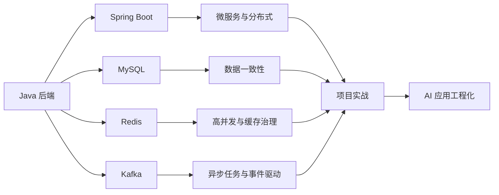

# Java 后端工程实践与 AI 技术笔记

这是一个面向 Java 后端开发、项目复盘和面试准备的个人技术知识库。

内容以真实工程问题为主，重点记录微服务设计、高并发治理、数据一致性、Redis、MySQL、大数据处理及 AI 应用工程化实践。

> 仓库中的项目名称、业务规模和数据均已做脱敏或泛化处理，仅用于技术交流与个人能力展示。

## 关于这个仓库

这里不会只整理概念和八股文，而是尽量回答以下问题：

- 这项技术在项目中解决什么问题？
- 它处于系统架构的哪个位置？
- 核心请求或数据链路如何运行？
- 线上可能出现哪些故障？
- 如何处理超时、重试、幂等、一致性与降级？
- 为什么选择这个方案，还有哪些替代方案？
- 面试时如何清楚、可信地表达？

## 技术方向

## 项目实战

### 1. 大数据资产管理平台

面向政企数据治理场景的数据资产与标签管理平台。

平台通过资源目录管理 Hive 数据，使用可视化画板编排标签规则，将规则 DAG 转换为 Hive SQL 和计算任务，再把运行结果注册为标签资产并同步至 Elasticsearch。

核心内容：

- 标签核心服务、计算服务和大模型服务的职责划分
- 规则 DAG 解析、拓扑排序与 Hive SQL 生成
- 标签任务编排、状态跟踪、失败重跑与结果追溯
- Hive 中间表与标签资产生命周期管理
- Elasticsearch 亿级数据索引重建与 Alias 切换
- RAG、自然语言转 SQL、资源推荐和 MCP 工具调用

技术栈：`Java`、`Spring Boot`、`MyBatis`、`MySQL`、`Redis`、`Hive`、`Flink`、`Kafka`、`Elasticsearch`、`Milvus`

[查看完整项目介绍](./项目/大数据资产管理平台项目介绍.md)

### 2. 营销短链与投放归因平台

面向短信、私域、渠道、物料和 App 拉新场景的营销投放平台。

平台以短链作为流量入口，通过低延迟 302 跳转承接访问，异步采集点击、注册、下单和支付事件，并按照统一规则完成渠道归因与 ROI 分析。

核心内容：

- Base62、MurmurHash 与短码唯一性设计
- 本地缓存、Redis、MySQL 三级跳转链路
- 布隆过滤器、缓存穿透与热 Key 治理
- Kafka 异步点击采集与事件幂等
- `traceId` 串联点击到支付的转化链路
- ClickHouse、Flink 与营销归因计算
- 异常点击识别和 302 主链路稳定性治理

技术栈：`Java`、`Spring Boot`、`MyBatis`、`MySQL`、`Redis`、`Kafka`、`ClickHouse`、`Flink`

[查看完整项目介绍](./项目/营销短链与投放归因平台项目介绍.md)

## AI 工程化

### 从代码生成到工程治理

AI Coding 的价值不只是提升代码生成速度，更重要的是让 AI 能够在团队既有架构和交付标准内稳定协作。

文章系统整理了：

- 组织级、仓库级、模块级和任务级 Rule
- Rule 作用域、优先级、冲突与例外处理
- Java 项目中的架构、事务、幂等和安全规则
- AI 生成、测试、Code Review 与 CI 执行闭环
- Rule 生命周期、版本治理和效果指标
- 创建订单与库存扣减的完整落地案例

[阅读：从代码生成到工程治理](./AI/从代码生成到工程治理：大型项目AI%20Coding%20Rule体系设计与落地.md)

## 知识库导航

| 目录 | 内容 | 状态 |
|---|---|---|
| [项目](./项目/) | 项目架构、技术难点、稳定性治理与面试表达 | 持续完善 |
| [AI](./AI/) | AI Coding、RAG、Agent 与 Java AI 工程化 | 持续完善 |
| Redis | 缓存、分布式锁、数据一致性与高可用 | 建设中 |
| MySQL | 索引、事务、锁、MVCC 与性能优化 | 建设中 |

## 持续更新

后续计划补充：

- Redis 缓存一致性、热 Key、分布式锁和故障治理
- MySQL 索引、事务、锁竞争、慢 SQL 和主从复制
- Spring Boot、微服务、消息队列与分布式系统
- RAG、Agent、Spring AI 和模型应用稳定性
- Java 后端项目复盘与面试深挖

如果这些内容对你有帮助，可以通过 Star 关注后续更新。
