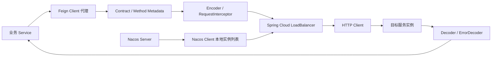
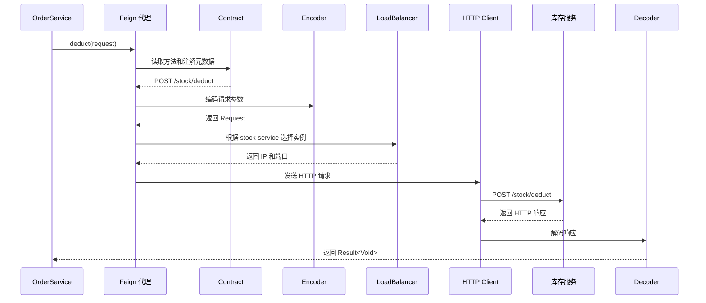
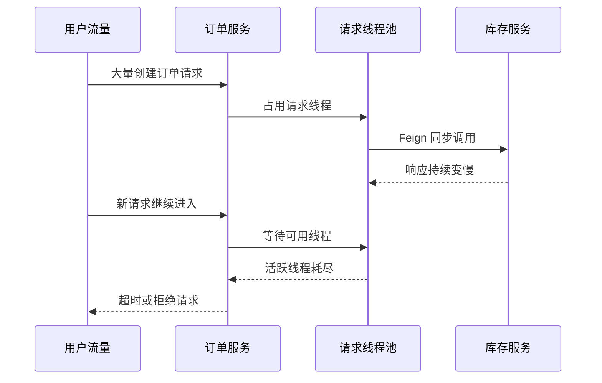
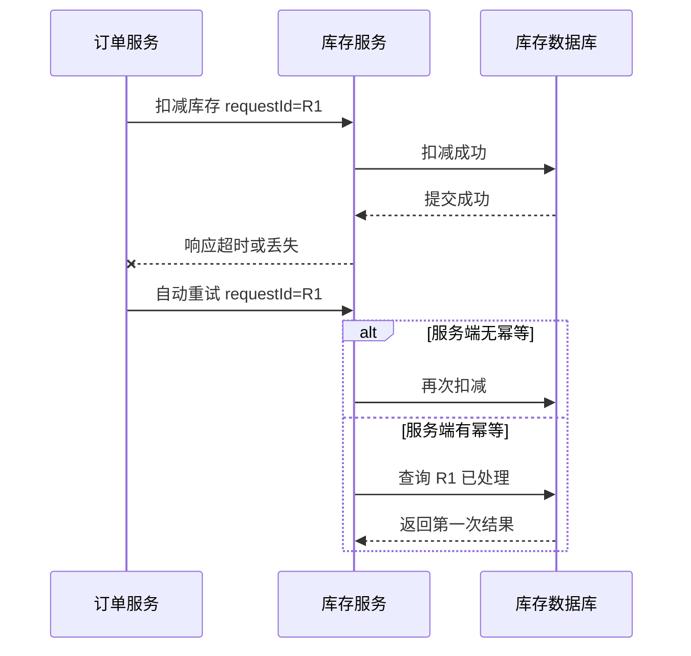
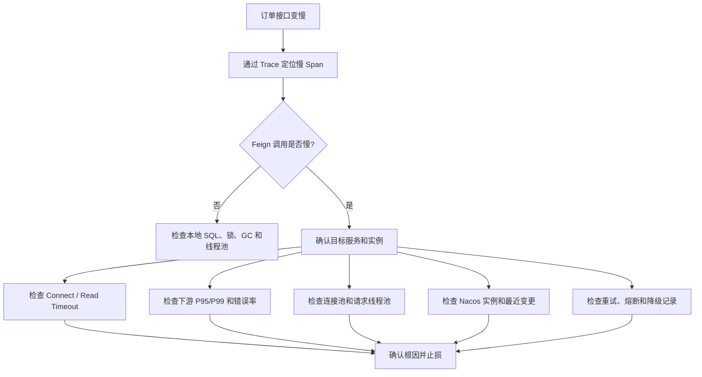

# Feign 远程调用原理与生产治理

> 本文以 Spring Cloud OpenFeign 为背景，配置项和组件行为可能随版本变化，具体项目应以当前 Spring Cloud、Spring Cloud Alibaba 和 Nacos 官方文档为准。

## 1. 项目场景：为什么 Feign 不只是远程调用工具

在微服务项目中，订单服务通常无法独立完成全部业务。

创建订单时，订单服务可能需要调用：

- 用户服务：校验用户状态。
- 商品服务：查询商品信息。
- 库存服务：扣减库存。
- 优惠券服务：锁定优惠券。
- 支付服务：创建支付单。

如果每次远程调用都手写 HTTP 请求，代码会比较分散：

```java
String url = "http://stock-service/stock/deduct";
ResponseEntity<Result> response =
        restTemplate.postForEntity(url, request, Result.class);
```

问题不只是代码不够简洁。进入生产环境后，还要面对：

- 服务实例扩容、缩容和下线。
- 下游服务超时、抖动和返回错误。
- 调用方线程被慢接口长期占用。
- 自动重试导致重复扣库存。
- 接口升级导致消费者不兼容。
- 跨服务问题难以通过日志定位。
- 注册中心不可用造成实例列表无法及时更新。

Feign 解决了声明和组织 HTTP 调用的问题，但有经验的后端更应该关注：

> 怎样让 Feign 调用做到稳定、可观测、可降级、可排查，并且不会把下游故障扩散到整个调用链。

## 2. 一句话定位 Feign

Feign 是声明式 HTTP 客户端。

在 Spring Cloud 项目中，开发人员通过接口和注解描述远程 API。应用启动时为接口创建代理对象，运行时把 Java 方法调用转换成 HTTP 请求，并结合编码解码、服务发现、负载均衡和 HTTP Client 完成远程调用。

一句话概括：

> Feign 让远程 HTTP 调用看起来像本地接口调用，但它本质上仍然是一次不可靠的跨网络调用。

“写起来像本地方法”不代表它拥有本地方法的稳定性。

## 3. Feign 在微服务调用链路中的位置

Feign 是服务调用入口，但不负责服务注册，也不负责维护服务实例。



各组件边界如下：

| 组件 | 主要职责 |
|---|---|
| Feign | 将接口方法调用组织成 HTTP 请求 |
| Nacos | 服务注册与发现，向客户端提供服务实例变化 |
| Nacos Client | 维护连接、订阅和本地服务实例视图 |
| LoadBalancer | 从当前实例列表中选择一个实例 |
| HTTP Client | 建立连接并发送网络请求 |
| Encoder | 把 Java 参数转换成请求体、查询参数或表单 |
| Decoder | 把响应转换成 Java 对象 |
| ErrorDecoder | 把异常 HTTP 响应转换成异常 |

Feign、Nacos 和 LoadBalancer 是协作关系，而不是同一个组件。

## 4. 为什么只定义接口就能调用

Feign 的关键机制是接口代理。

```java
@FeignClient(name = "stock-service", path = "/stock")
public interface StockClient {

    @PostMapping("/deduct")
    Result<Void> deduct(@RequestBody StockDeductRequest request);

    @GetMapping("/{productId}")
    Result<StockInfoDTO> getStock(
            @PathVariable("productId") Long productId);
}
```

业务代码可以直接注入：

```java
@Service
public class OrderService {

    private final StockClient stockClient;

    public OrderService(StockClient stockClient) {
        this.stockClient = stockClient;
    }

    public void createOrder(Long productId, Integer count) {
        StockDeductRequest request =
                new StockDeductRequest(productId, count);
        stockClient.deduct(request);
    }
}
```

`StockClient` 没有手写实现类。应用启动时，Spring Cloud OpenFeign 扫描 `@FeignClient`，根据接口元数据创建代理并放入容器。

调用 `stockClient.deduct(request)` 时，执行的是代理逻辑。



Feign 原理可以压缩为：

> 启动时创建接口代理，运行时拦截方法调用，根据注解构造 HTTP 请求，再结合服务发现、负载均衡和 HTTP Client 完成远程调用。

## 5. 核心组件

| 组件 | 作用 | 面试表达 |
|---|---|---|
| `@FeignClient` | 声明远程服务接口 | 指定服务名、路径和配置 |
| 接口代理 | 拦截方法调用 | 把 Java 方法调用转换成远程调用 |
| Contract | 解析接口注解 | 识别请求方法、路径和参数 |
| Encoder | 请求编码 | Java 对象转换成 JSON、表单或参数 |
| Decoder | 响应解码 | HTTP 响应转换成 Java 对象 |
| ErrorDecoder | 错误解码 | 非正常响应转换成异常 |
| LoadBalancer | 实例选择 | 从当前服务实例列表选择目标 |
| HTTP Client | 网络调用 | 管理连接并执行 HTTP 请求 |
| RequestInterceptor | 请求增强 | 透传 Trace ID、Token 等上下文 |

面试不必死记全部类名，但应能说清：

```text
接口代理
-> 注解解析
-> 请求编码
-> 服务发现
-> 负载均衡
-> HTTP 调用
-> 响应解码
```

## 6. 项目中怎样使用 Feign

### 6.1 按服务定义 Client

不要把多个服务的接口放进同一个 Client。

```java
@FeignClient(name = "stock-service", path = "/stock")
public interface StockClient {

    @PostMapping("/deduct")
    Result<Void> deduct(@RequestBody StockDeductRequest request);

    @GetMapping("/{productId}")
    Result<StockInfoDTO> getStock(
            @PathVariable("productId") Long productId);
}
```

```java
@FeignClient(name = "user-service", path = "/users")
public interface UserClient {

    @GetMapping("/{userId}")
    Result<UserDTO> getUser(@PathVariable("userId") Long userId);
}
```

这样做便于：

- 明确服务边界。
- 管理独立超时和降级策略。
- 统计各下游服务的调用指标。
- 排查具体依赖问题。

### 6.2 DTO 不要直接使用数据库实体

不推荐：

```java
@PostMapping("/deduct")
Result<Void> deduct(@RequestBody StockEntity entity);
```

推荐定义服务契约：

```java
public class StockDeductRequest {
    private Long productId;
    private Integer count;
    private String requestId;
}
```

远程接口是服务契约，不是数据库表结构。直接暴露 Entity 会导致数据库字段、敏感字段和服务接口强耦合。

### 6.3 写接口必须考虑幂等

扣库存发生超时时，调用方不知道服务端是否已经成功执行。

如果直接重试，可能重复扣减。

```java
public class StockDeductRequest {
    private Long productId;
    private Integer count;
    private String orderNo;
    private String requestId;
}
```

服务端可以根据场景使用：

- 数据库唯一索引。
- 幂等记录表。
- 业务流水号。
- 状态机。
- Redis 去重。
- 分布式锁。

分布式锁不是幂等的唯一方案。对持久化写操作，业务唯一约束通常更加可靠。

## 7. 超时：下游变慢为什么会拖垮调用方

Feign 通常用于同步调用。调用方线程需要等待远程响应。

如果库存服务耗时从 50ms 增加到 5s，订单服务线程就会被大量占用。



这就是典型的下游慢调用向上游扩散。

### 7.1 超时类型

| 超时 | 含义 |
|---|---|
| Connect Timeout | 与目标实例建立连接的最长等待时间 |
| Read Timeout | 建立连接后等待响应数据的最长时间 |

配置示例：

```yaml
spring:
  cloud:
    openfeign:
      client:
        config:
          default:
            connectTimeout: 3000
            readTimeout: 5000
```

配置项应以项目当前 Spring Cloud OpenFeign 版本为准。

### 7.2 超时怎样设置

| 调用类型 | 建议 |
|---|---|
| 查询接口 | 根据 P95/P99 设置相对较短的超时 |
| 核心写接口 | 结合幂等、状态查询和补偿机制 |
| 第三方接口 | 独立超时、隔离、熔断和降级 |
| 慢任务 | 不建议长期占用同步 Feign，考虑异步任务或 MQ |

超时时间太短会误伤正常请求，太长又会占满线程和连接。不能通过无限调大超时掩盖下游性能问题。

## 8. 重试：为什么可能造成重复写

第一次扣库存可能已经成功，但响应在网络中丢失或超过读取超时。



重试策略必须根据操作语义决定：

| 场景 | 是否建议重试 | 说明 |
|---|---|---|
| 查询接口 | 可以有限重试 | 通常没有写副作用 |
| 幂等写接口 | 可以谨慎重试 | 必须有 `requestId` 或业务流水 |
| 非幂等写接口 | 不建议自动重试 | 可能重复写入 |
| 支付、退款 | 非常谨慎 | 依赖状态机、流水号和结果查询 |

Spring Cloud LoadBalancer 的重试行为也应纳入评估。当前官方配置支持限制同实例、下一实例、请求方法和异常类型等重试范围，不应直接对所有操作开启重试。

## 9. 下游故障怎样引发级联故障

如果库存服务已经不可用，订单服务仍持续同步请求，就会产生：

```text
库存服务故障
-> Feign 请求超时
-> 订单线程持续阻塞
-> 线程池和连接池耗尽
-> 订单接口超时
-> 上游网关重试
-> 故障进一步放大
```

治理措施：

1. 设置合理超时。
2. 失败率升高时熔断并快速失败。
3. 对非核心依赖提供业务降级。
4. 对调用量进行限流。
5. 对不同依赖做资源隔离。
6. 接入指标、Trace 和告警。

降级必须符合业务语义：

- 推荐服务失败，可以返回空推荐。
- 用户头像失败，可以显示默认头像。
- 库存扣减失败，不能返回下单成功。
- 支付状态查询失败，不能伪造支付成功。

## 10. Nacos 挂掉对 Feign 有什么影响

Nacos 挂掉不会改变 Feign 代理本身，但会影响服务发现和实例列表更新。

正常链路是：

```text
Nacos Server
-> Nacos Client 订阅并维护本地实例视图
-> Spring Cloud LoadBalancer 获取实例
-> Feign 发送请求
```

### 10.1 已经运行的消费者

Nacos Client 负责连接、订阅、本地缓存和断线恢复。

如果消费者已经获取过实例：

- 短时间内可能继续使用本地已有实例列表。
- LoadBalancer 仍可以从旧列表选择目标实例。
- Feign 不会因为 Nacos 刚刚中断而立即全部失败。

但此时实例列表无法正常更新：

- 新实例无法及时加入。
- 已下线实例可能仍在旧列表中。
- 扩缩容无法及时生效。
- 可能继续选择失效 IP，出现连接失败或超时。

这属于服务实例视图的最终一致性，不是强一致性。

### 10.2 应用重新启动

如果启动时无法连接 Nacos：

- 服务发现可能无法获取可用实例。
- Feign 调用可能出现无可用实例。
- 如果应用还依赖 Nacos Config，启动过程也可能受影响。

具体能否启动取决于客户端版本、配置和失败处理策略。

### 10.3 LoadBalancer 会主动请求 Nacos 吗

不是每次 Feign 请求都直接访问 Nacos Server。

LoadBalancer 通常通过服务发现抽象获取当前实例列表，并在本地完成实例选择。实例列表的连接、订阅、缓存和恢复主要由 Nacos Client 负责。

LoadBalancer 默认也不能保证选中的实例此刻一定健康。若使用额外的健康检查 `ServiceInstanceListSupplier`，还需要结合注册中心提供的实例更新机制谨慎配置，避免重复探测和额外压力。

### 10.4 生产治理

- Nacos 使用集群部署。
- 监控 Client 连接和订阅状态。
- 监控无可用实例、连接拒绝和超时错误。
- Feign 设置超时、熔断和限流。
- 谨慎设置重试，避免注册中心故障时形成重试风暴。
- 核心系统准备注册中心故障预案。

## 11. 接口版本不兼容

Feign 接口本质上属于服务契约。

常见不兼容修改包括：

- 返回字段类型变化。
- 删除调用方依赖的字段。
- 接口路径调整。
- 必填参数增加。
- 错误码结构改变。
- 老消费者尚未升级，提供方已切换新版本。

治理方式：

- 新增字段优先保持可选和向后兼容。
- 不随意改变字段类型和语义。
- 重大变更新增版本路径。
- 灰度发布并保留回滚能力。
- 进行消费者驱动契约测试。
- 消费方容忍不关心的新增字段。

多个服务直接共享同一个 DTO 依赖虽然省事，但容易形成发布耦合。是否共享契约包，需要结合团队发布方式和兼容策略决定。

## 12. Feign、RestTemplate、WebClient 和 MQ 怎样选择

| 方案 | 优点 | 缺点 | 适合场景 |
|---|---|---|---|
| Feign | 声明清晰，与 Spring Cloud 生态集成 | 同步调用容易隐藏网络成本 | 微服务内部同步 HTTP |
| RestTemplate | 简单，存量项目常见 | URL 和参数处理较手工 | 老项目和简单调用 |
| WebClient | 支持响应式和异步非阻塞 | 调试和上下文传播更复杂 | 响应式系统、高并发 IO |
| MQ | 解耦、削峰、提高可用性 | 最终一致，链路复杂 | 非实时、可异步业务 |

Feign 适合同步查询或必须立即获得结果的调用。

对于发短信、发积分、更新画像等非实时业务，不应为了调用方便而全部使用 Feign，可以通过 MQ 异步处理。

## 13. 稳定性治理清单

| 治理项 | 目的 | 项目做法 |
|---|---|---|
| 超时 | 防止线程长期等待 | Connect Timeout、Read Timeout |
| 重试 | 应对短暂网络抖动 | 仅对幂等操作有限开启 |
| 幂等 | 防止重复写 | `requestId`、唯一索引、状态机 |
| 熔断 | 防止下游持续拖垮上游 | 失败率或慢调用达到阈值后快速失败 |
| 降级 | 保证核心功能可用 | 非核心数据兜底或终止当前流程 |
| 限流 | 防止流量打爆服务 | 网关、调用方和服务端限流 |
| 隔离 | 限制故障影响范围 | 连接池、线程池和信号量隔离 |
| 链路追踪 | 定位跨服务慢调用 | Trace ID、Span 和调用耗时 |
| 指标监控 | 提前发现趋势 | 成功率、错误率、P95、P99 |
| 契约治理 | 降低升级风险 | 版本兼容、灰度、契约测试 |

Spring Cloud OpenFeign 可以与 Spring Cloud LoadBalancer 和 Spring Cloud CircuitBreaker 集成，但 CircuitBreaker 是否启用、使用何种实现以及 Fallback 行为，需要根据项目依赖和配置确认。

## 14. 线上怎样排查 Feign 慢调用



### 14.1 重点指标

- 调用方接口总耗时。
- Feign Client 调用耗时。
- 下游服务 P95 和 P99。
- HTTP 状态码与异常类型。
- Connect Timeout 和 Read Timeout 数量。
- 请求线程池活跃数和队列长度。
- HTTP 连接池使用率。
- Nacos Client 连接和实例订阅状态。
- LoadBalancer 无可用实例次数。
- 重试、熔断和 Fallback 次数。
- 最近发布和配置变更。

### 14.2 推荐排查顺序

1. 使用 Trace 找到最慢的远程调用。
2. 确认耗时发生在连接、服务执行还是响应读取阶段。
3. 查看下游实例自身的日志、指标和依赖。
4. 检查调用方线程池与连接池是否耗尽。
5. 检查 Nacos 实例视图和 LoadBalancer 选择结果。
6. 检查最近发布、配置和流量变化。
7. 根据业务影响执行限流、熔断、摘除实例或回滚。

## 15. 常见问题

### 15.1 把 Feign 当成本地方法

Feign 仍可能发生：

- 网络错误。
- 建连和读取超时。
- 序列化失败。
- 下游服务异常。
- 实例列表过期。
- 接口契约不兼容。

每个 Feign Client 都应该被当成不可靠的外部依赖。

### 15.2 没有设置超时

不设置合理超时会导致下游慢调用长期占用调用方资源。

### 15.3 写接口无条件自动重试

扣库存、创建订单、发券、支付和退款如果没有幂等，不能自动重试。

### 15.4 Fallback 吞掉真实失败

Fallback 不能为了让接口返回成功而制造假数据。

### 15.5 没有透传 Trace ID

至少应该保证：

- 请求入口创建或接收 Trace ID。
- Feign 拦截器透传上下文。
- 下游日志包含 Trace ID。
- 链路系统可以还原调用关系。

### 15.6 远程调用放进大事务

数据库事务中执行多个慢远程调用，会长期占用数据库连接和锁。

需要根据一致性要求采用事务消息、Saga、补偿或状态机，而不是依赖一个本地事务覆盖跨服务操作。

## 16. 面试怎么说

### 16.1 30 秒回答

> Feign 是 Spring Cloud 中常用的声明式 HTTP 客户端。它通过 `@FeignClient` 定义远程接口，启动时生成代理对象；调用接口方法时，代理会解析注解、构造 HTTP 请求，并结合服务发现、LoadBalancer、编码解码和 HTTP Client 完成调用。生产中重点不是写接口，而是治理超时、重试、幂等、熔断降级、链路追踪和接口兼容性。

### 16.2 2 分钟展开

> 项目中通常使用 Feign 做微服务之间的同步 HTTP 调用，例如订单服务调用库存和用户服务。它让服务契约更清晰，但我不会把它当作本地方法，因为背后包含服务发现、实例选择、网络连接、序列化和响应解码。
>
> 生产中我会重点做五类治理。第一是合理设置连接和读取超时，避免下游慢调用占满线程；第二是谨慎重试，查询接口可以有限重试，写接口必须先保证幂等；第三是通过熔断、降级、限流和隔离防止下游故障扩散；第四是接入 Trace 和 Metrics，观察每个下游的耗时和错误率；第五是把 Feign 接口当成服务契约，保证版本兼容和灰度发布。
>
> Feign 与 Nacos、LoadBalancer 的职责也不同。Nacos Client 负责服务订阅和本地实例视图，LoadBalancer 从实例列表选择实例，Feign 负责组织 HTTP 调用。Nacos 短暂不可用时，运行中的客户端可能继续使用旧实例列表，但无法及时感知实例变化，因此仍需要超时、熔断和注册中心高可用。

### 16.3 面试官深挖

#### Feign 为什么只写接口就能调用？

Spring 启动时为 `@FeignClient` 接口创建代理。运行时代理解析方法注解和参数，构造请求，再通过 LoadBalancer 选择实例并交给 HTTP Client。

#### Feign 与 Nacos、LoadBalancer 是什么关系？

Nacos 负责注册发现，Nacos Client 维护本地服务实例视图，LoadBalancer 选择实例，Feign 组织请求，HTTP Client 真正发送网络数据。

#### Nacos 挂了 Feign 会立即失败吗？

不一定。已经运行的客户端可能暂时使用本地旧实例列表继续调用，但无法感知实例上下线。如果旧实例失效或应用重新启动无法获取实例，就会出现连接失败或无可用实例。

#### LoadBalancer 每次请求都会访问 Nacos 吗？

通常不会每次直接访问 Nacos Server。实例订阅、本地缓存和断线恢复主要由 Nacos Client 负责，LoadBalancer 基于当前实例列表在本地选择目标。

#### Feign 超时怎样处理？

区分连接超时和读取超时，根据下游 P95/P99 和业务承受时间配置；同时结合熔断、隔离、限流和告警，不能只把超时调大。

#### Feign 重试有什么风险？

第一次调用可能已经成功但响应超时。写接口如果没有幂等，重试会造成重复扣库存、下单或发券。

#### 下游挂了怎样防止拖垮上游？

设置超时，失败达到阈值后熔断，对非核心依赖降级，并通过限流和资源隔离控制影响范围。

#### 什么时候不使用 Feign？

非实时、耗时、允许最终一致的业务更适合 MQ，例如发短信、积分和画像更新；响应式高并发 IO 场景也可以评估 WebClient。

## 17. 总结

Feign 的核心价值是让微服务 HTTP 调用声明化和接口化。

但对有项目经验的 Java 后端来说，更重要的是讲清：

- Feign 为什么只定义接口就能调用。
- Feign、Nacos、LoadBalancer 和 HTTP Client 的职责边界。
- 超时和慢调用为什么会拖垮上游。
- 重试为什么会造成重复写。
- Nacos 故障时本地实例列表怎样影响调用。
- 怎样做熔断、降级、限流和隔离。
- 怎样通过 Trace、Metrics 和日志排查问题。
- 什么时候使用 Feign，什么时候改用 MQ。

一句话总结：

> Feign 解决服务间 HTTP 调用的开发效率问题，生产环境真正要解决的是远程调用的不可靠性和故障传播。

## 参考资料

- [Spring Cloud OpenFeign 官方文档](https://docs.spring.io/spring-cloud-openfeign/reference/spring-cloud-openfeign.html)
- [Spring Cloud OpenFeign 配置项](https://docs.spring.io/spring-cloud-openfeign/reference/configprops.html)
- [Nacos SDK 概览](https://nacos.io/en/docs/latest/manual/user/overview/other-language/)
- [Nacos Java SDK 使用说明](https://nacos.io/en/docs/latest/manual/user/java-sdk/usage/)
