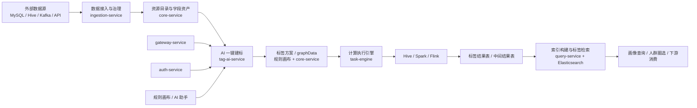
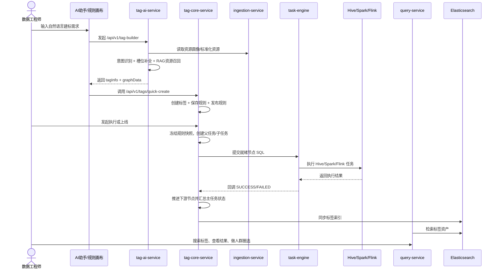
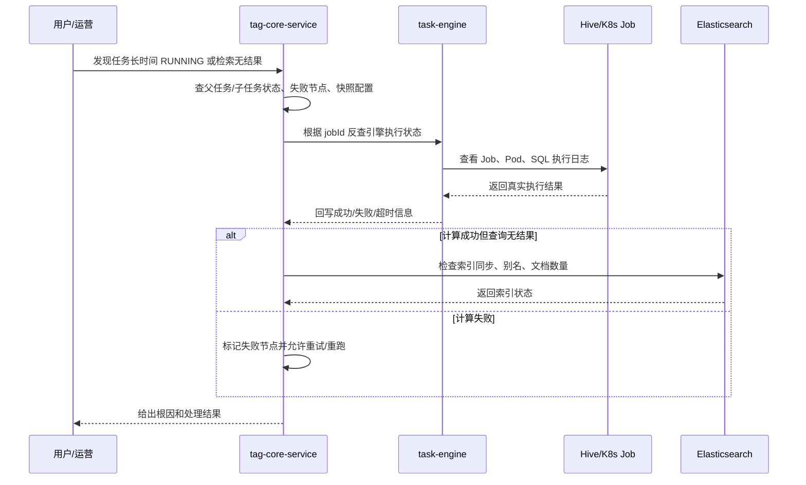

# 大数据资产管理平台项目介绍：以 AI 一键建标为核心的标签资产生产平台

> 本文为公开展示版，项目名称、业务口径和部署规模均做了泛化处理。

## 项目场景

这个项目面向政务/公安类大数据治理场景，核心问题不是“有没有数据”，而是“数据很多，但很难稳定变成可用资产”。

实际业务里经常会遇到这些问题：

- 数据分散在 MySQL、Hive、Kafka、外部接口等不同来源，字段口径不统一。
- 业务方知道自己想要什么标签，但不会长期维护复杂 SQL。
- 一个标签往往不是一张表直接查出来，而是多张表清洗、关联、聚合之后的结果。
- 离线任务运行时间长，失败后如果没有快照和中间结果，很难重跑和追溯。
- 标签算出来还不够，最终还要支持检索、圈选、画像和下游系统消费。

所以这个项目本质上不是一个普通的“标签管理后台”，而是一个**以 AI 一键建标为入口，把数据资源转成标签资产的生产平台**。

## 一句话定位

**平台最核心的功能是 AI 一键建标：用户输入自然语言场景，系统自动完成意图识别、资源召回、标签方案生成、规则落库和可选发布，底层再由数据治理、DAG 执行和索引服务把方案真正落成标签资产。**

## 我的职责

我主要参与的是 AI 建标主链路以及其后的平台承接能力，重点在后端中台、任务执行和 AI 集成这一段：

- 参与标签核心服务建设，包括资源目录、标签开发、规则版本、任务调度、索引治理等模块。
- 参与规则画布落库、DAG 解析、算子 SQL 生成和执行链路编排。
- 参与父子任务模型、失败重试、任务重跑、执行去重和回调推进机制设计。
- 参与标签结果同步 Elasticsearch，以及索引重建、校验和别名切换方案。
- 参与 AI 一键建标能力接入，包括资源推荐、RAG 召回、自然语言意图识别和建标结果落库。

## 架构位置

先看整个平台在业务链路里的位置，重点关注“用户一句自然语言需求，是怎么一步步变成可运行标签的”。

这张图里最关键的点有三个：

- `tag-ai-service` 不只是聊天助手，而是承担了“自然语言需求 -> 标签方案”的主入口。
- `core-service` 不是只做标签 CRUD，而是承接 AI 生成结果，把规则、任务、结果和索引真正串成可执行链路。
- 标签执行完成不是终点，最终目标还是把结果沉淀成可查询、可复用、可审计的数据资产。

## 核心技术栈

| 层级 | 技术 |
|---|---|
| 后端 | Java 17、Spring Boot、Spring Cloud、Spring Cloud Alibaba |
| 存储 | MySQL、Redis、Hive、Elasticsearch |
| 计算 | Spark、Flink、Hive on K8s |
| 消息与治理 | Kafka、Sentinel、SkyWalking |
| 前端 | Vue 3、Vite、Pinia、AntV G6 |
| AI | Spring AI、DeepSeek、Milvus、RAG |

## 核心服务拆分

| 服务 | 主要职责 |
|---|---|
| `tag-gateway-service` | API 统一入口、路由转发 |
| `tag-auth-service` | 登录认证、用户角色、部门权限 |
| `tag-core-service` | 标签全生命周期、规则画布、任务调度、资源目录、索引治理、一键建标落库 |
| `tag-task-engine-service` | SQL 任务提交与计算引擎执行 |
| `tianji-tag-ingestion-service` | 数据接入、融合、标准化、质量治理 |
| `tag-query-service` | 标签检索、人群圈选、搜索服务 |
| `tag-ai-service` | AI 一键建标、RAG 检索、资源推荐、自然语言转 SQL |
| `tag-rule-canvas` | 规则画布和标签开发前端 |

## 核心流程

下面这条链路更贴近这个项目现在最核心的功能，也就是“AI 一键建标”。

这条流程可以拆成五个阶段来理解。

### 1. AI 一键建标入口

这是现在项目最有辨识度的功能。

用户在 AI 助手里直接输入一句业务需求，比如“帮我建一个近 30 天高频出入某区域人员标签”，系统不会只返回一段解释文本，而是会进入真正的建标流程：

- 先判断用户输入是建标、问帮助、做资源分析，还是信息不完整需要继续追问。
- 对建标需求提取关键槽位，比如时间范围、对象、行为、过滤条件、目标标签口径。
- 结合本地资源目录和 RAG 召回结果，找到最相关的数据表和字段。
- 生成结构化的 `tagInfo + graphData`，供前端直接落到规则画布或一键创建。

这一步的价值在于，它把“业务需求理解”真正前移到了系统里，而不是只做一个聊天机器人。

### 2. 数据接入与治理

这一步主要由 `tianji-tag-ingestion-service` 负责，目标不是简单“录入一个数据源”，而是把原始数据治理成后续标签开发能直接使用的资源。

主要能力包括：

- 数据源连接测试和接入管理。
- 多源数据融合。
- 字段标准化、字典映射、格式归一。
- 非空、唯一性、范围、正则、一致性等质量校验。

这层的价值很直接：如果没有前置治理，AI 建标就算能生成方案，也拿不到稳定可用的本地资源。

### 3. 标签开发与规则编排

这一步由 `tag-ai-service`、前端画布和 `tag-core-service` 一起完成。

业务人员不一定需要从零拖拽算子。更常见的路径是：

- 先让 AI 根据自然语言场景生成完整标签方案。
- 前端拿到 `graphData` 后直接回填到画布。
- 如果需要人工微调，再补充算子参数或改边关系。

底层仍然会把这套规则保存成可执行 DAG，而不是把 AI 输出当成一段描述文本。

这里保存的不只是一个 `canvasJson`，而是一份可以落地执行的规则定义，包括：

- 算子节点配置。
- 节点之间的边关系。
- 输入资源和字段依赖。
- 输出字段和目标表定义。
- 规则版本快照。

### 4. 任务执行与调度

这是 AI 一键建标真正落地的承接层，也是工程难点最多的地方。

规则生成并不代表标签已经建好了。`core-service` 会进一步把 AI 方案转换成真实规则，完成创建标签、保存规则、发布规则，并在执行阶段根据 DAG 创建父任务和算子子任务，识别所有就绪节点，按算子类型生成 SQL，再交给 `task-engine-service` 提交到 Hive、Spark 或 Flink 运行。

整个执行过程不是同步阻塞等待，而是**事件驱动 + HTTP 回调推进 DAG**。

### 5. 结果沉淀与服务化

标签结果不会只停留在 Hive 结果表里。

平台还会继续做三件事：

- 沉淀结果表和运行元数据，便于审计、重跑和问题定位。
- 构建 Elasticsearch 索引，支撑标签搜索和资产检索。
- 对外提供圈选、画像和下游系统消费能力。

这也是它和普通离线任务平台最大的区别之一：  
**它最终交付的不是一次性计算结果，而是可持续管理的业务资产。**

## 项目里怎么用

如果站在一个标签开发人员的视角，这个平台现在更像这样使用：

1. 先在 AI 助手里输入自然语言建标需求。
2. 系统自动判断意图，召回本地资源，并生成标签方案和规则图。
3. 前端把 AI 生成的 `graphData` 回填到画布，用户可以直接确认，也可以人工微调。
4. 后端通过一键建标接口完成标签创建、规则保存和发布。
5. 再触发执行或配置调度，把规则真正跑成标签结果。
6. 任务完成后，把结果作为标签资产沉淀，并同步 ES 供后续检索和消费。

这套链路能把“原本靠人手写 SQL、手工搭画布的离散工作”，前移成“自然语言驱动 + 平台承接执行”的能力。

## 项目难点

这个项目最值得讲的，不在于用了多少框架，而在于它把几个本来容易失控的点做成了稳定的平台能力。

### 难点一：AI 不是只返回文本，而是要生成可执行标签方案

很多 AI 功能只能做到“给建议”，但一键建标要做到的是：

- 能识别用户到底是不是在建标。
- 关键信息缺失时能停下来追问，而不是硬编一条错误管线。
- 能结合本地资源目录和 RAG 结果，找到真实可用的数据源。
- 最终输出结构化的 `tagInfo + graphData`，而不是一段看起来合理但没法执行的自然语言说明。

这一步如果做不好，AI 只能算助手，不能算建标入口。

### 难点二：规则画布不是展示层，而是可执行规则定义

前端看到的是节点和边，后端要解决的是：

- 怎么保存规则版本。
- 怎么做 DAG 无环校验和拓扑排序。
- 怎么把不同算子配置转成统一执行模型。
- 怎么保证字段血缘、输入输出表和依赖关系可追踪。

如果这里只把画布当 JSON 保存，后面很难支撑预览、重跑、快照和审计。

### 难点三：长任务不能同步等，必须做事件驱动编排

标签任务执行时间从秒级到小时级都有可能，如果核心服务同步等待：

- 会长期占用业务线程。
- 多节点并行执行难以收敛。
- 服务重启后很难恢复执行状态。

所以这里采用了父任务 + 算子子任务模型，再通过引擎回调推进 DAG 状态机。

### 难点四：规则会变化，执行必须可追溯

标签规则不是静态不变的，如果运行时直接读取实时规则，会出现：

- 同一个任务前后执行逻辑不一致。
- 线上问题无法复盘。
- 重跑时拿不到当时的真实配置。

所以项目里对“任务执行使用规则快照”这件事非常重视。  
快照不是性能优化，而是**审计能力和重跑能力的基础**。

### 难点五：手动执行、调度执行、回调重试天然会遇到幂等问题

这种平台很容易出现几类重复：

- 同一规则被手动执行和定时调度同时命中。
- 引擎回调重复投递。
- 服务重启后恢复扫描重复提交。
- 失败重试时重复推进下游节点。

所以真正的难点不是“调一下接口”，而是保证：

- 同一规则不能重叠运行。
- 同一计划时间不能重复触发。
- 同一回调重复到达也不能把父任务状态聚合错。

### 难点六：标签结果要变成资产，而不是一次性 Hive 表

单纯把结果落到 Hive 只能证明“算完了”，不能证明“能用起来”。

项目里还要继续解决：

- 怎么把标签元数据同步到 Elasticsearch。
- 怎么做索引重建、增量同步和一致性校验。
- 怎么避免索引切换影响线上查询。
- 怎么让标签结果支持搜索、圈选和画像消费。

这部分决定了平台交付的是离线任务，还是业务资产。

## 生产问题/常见坑

这类平台上线后，真正容易出问题的地方通常不在 CRUD，而在链路边界。

### 1. 回调丢失导致任务卡住

引擎执行成功，但核心服务没有收到回调，父任务就可能一直停在 `RUNNING`。

项目里通常会通过恢复扫描器补偿：

- 定期扫描长时间未推进的子任务。
- 根据 `jobId` 反查引擎状态。
- 如果引擎已成功，则补写回调等价事件。
- 如果引擎已失败，则回写失败原因并停止下游推进。

### 2. UDF 重复注册导致 Hive 任务失败

标签规则里大量算子会依赖身份证、手机号、IP、MAC 等领域 UDF。  
如果每次执行都无条件 `CREATE FUNCTION`，永久函数第二次创建就会报 `AlreadyExistsException`。

后面做法是：

- 核心服务先根据业务 SQL 识别真实依赖的 UDF。
- 通过任务引擎查询 Hive 中函数是否已存在。
- 不存在才注册，存在则跳过。
- 引擎侧只对明确的重复创建错误做兜底，不吞真实故障。

### 3. 定时调度和手动执行重叠

如果一个规则本身已经在跑，新的调度周期又到了，这时候最容易出现结果覆盖和资源争抢。

当前更稳妥的策略通常是 `SKIP` 而不是强行并行：

- 避免同名结果表冲突。
- 避免旧任务晚于新任务完成，反向覆盖数据。
- 降低 Hive 资源争抢和补偿复杂度。

### 4. 索引和结果表不一致

任务执行成功不代表 ES 一定可查。  
如果索引同步失败，就会出现“Hive 有结果，检索查不到”的典型问题。

所以线上排查时要分两段看：

- 标签是否真的算出来了。
- 结果是否真的成功进入索引。

## 方案取舍

下面这些是这个项目里比较典型、也比较适合在面试里展开的设计取舍。

| 方案 | 选择 | 优点 | 代价 |
|---|---|---|---|
| 纯聊天建议 vs 一键生成可执行方案 | 选择一键生成方案 | 真正缩短建标路径，能直接落画布和规则 | 对意图识别、资源召回、结构化输出要求更高 |
| 直接写 SQL vs 画布编排 DAG | 选择画布编排 | 规则可视化、可复用、易预览、便于承接 AI 输出 | 后端抽象复杂度更高 |
| 同步执行 vs 回调推进 | 选择事件驱动 + 回调 | 长任务友好、不占线程、适合并行节点 | 状态机、幂等和恢复逻辑更复杂 |
| 读实时规则 vs 执行快照 | 选择快照 | 可审计、可重跑、可复盘 | 需要维护快照和版本成本 |
| 结果只落 Hive vs 同步 ES | 选择结果服务化 | 支持搜索、圈选、资产化消费 | 多一层索引一致性治理 |
| 调度重叠并行 vs 跳过 | 默认跳过 | 复杂度低，避免覆盖和资源争抢 | 会牺牲部分周期完整性 |

## 稳定性治理

我觉得这个项目最能体现“中台味道”的地方，就是稳定性治理做得比较完整。

### 1. 幂等与防重

- 规则级分布式锁，避免同一规则重复提交。
- 调度触发记录唯一键，避免同一计划时间重复触发。
- 子任务原子抢占，避免多个实例重复分发同一节点。
- 回调按任务状态做幂等处理，避免重复推进。

### 2. 可恢复

- 任务执行前冻结规则快照。
- 保留父任务和子任务运行状态。
- 提供失败重试、整链重跑、单算子执行能力。
- 通过恢复扫描器补偿回调丢失和硬超时任务。

### 3. 可观测

至少要重点关注这些指标：

- 主任务成功率。
- 子任务失败率。
- 卡住节点数量。
- 回调超时和丢失次数。
- 单算子耗时分布。
- 调度漏跑、跳过和补偿次数。
- ES 同步延迟和索引一致性状态。

### 4. 可控

平台型系统不能只让任务“自己跑”，还要给业务和运维足够控制面：

- 手动执行。
- 定时调度。
- 单算子预览。
- 失败重试。
- 整链重跑。
- 索引重建、校验和别名切换。

## 线上排查路径

这类项目排查问题时，我一般会按“任务层 -> 引擎层 -> 数据层 -> 索引层”去看。

这条排查路径背后的思路是：

- 先确认是“没算出来”，还是“算出来了但没服务化”。
- 再确认是核心服务没推进、任务引擎没跑起来，还是底层计算失败。
- 最后再看索引同步和查询链路。

## 面试怎么说

### 30 秒回答

这个项目最核心的功能是 AI 一键建标。用户输入自然语言场景后，AI 服务会先做意图识别、槽位补全和本地资源召回，生成结构化的标签方案和规则图；然后核心服务通过一键建标接口把方案落成标签、规则和版本，再交给任务引擎异步执行，最后把结果沉淀到 Hive 和 Elasticsearch。真正的难点不在聊天，而在 AI 结果怎么可靠落成可执行 DAG，以及后面的快照、幂等、恢复和结果服务化。

### 2 分钟展开

如果从业务链路看，这个平台可以分成两段。前半段是 AI 一键建标，用户在前端输入一句业务需求，`tag-ai-service` 会先判断输入是建标、资源分析还是帮助问答；如果是建标，再提取关键业务口径，结合本地资源目录、字段画像和 RAG 召回结果，生成 `tagInfo + graphData`。后半段是平台承接执行，前端把 AI 生成的图回填到画布后，可以直接调用 `quick-create` 接口完成标签创建、规则保存、发布和可选上架；执行阶段再由 `tag-core-service` 负责快照、父子任务、SQL 生成和 DAG 推进，`task-engine-service` 负责底层 Hive、Spark、Flink 运行，最终把结果同步到 Elasticsearch 供检索和圈选。

我觉得这个项目最能讲深度的点有三个。第一，AI 不只是聊天，而是输出可执行的标签方案。第二，AI 生成的规则不是终点，后面必须有稳定的 DAG 执行、幂等防重和失败恢复去承接。第三，标签结果不是一次性离线表，而是要继续做成可检索、可复用的数据资产。

### 面试官可能深挖的问题

- 为什么你们把 AI 一键建标当成核心功能，而不是辅助功能？
- AI 返回的为什么不能只是一段建议文本，为什么一定要结构化成 `graphData`？
- 为什么规则执行一定要做快照，而不是直接读实时规则？
- 为什么任务要拆成父任务和算子子任务，而不是一个总任务跑到底？
- 如果回调丢失了，怎么避免任务永久卡住？
- 为什么调度重叠默认选择 `SKIP`，而不是排队或者并行？
- 为什么标签结果一定要同步 ES，而不是只保留 Hive 表？
- 如果让我继续优化，我会先补哪块能力？

## 总结

这个项目最有价值的地方，不是“把 SQL 跑起来”，也不是“接一个聊天大模型”，而是把 **AI 一键建标** 真正做成了业务入口，再用后面的规则编排、异步执行和索引治理把它落成可运行、可追溯、可检索的数据资产。

如果从技术实现看，它是 AI 建标、多服务协作、DAG 编排、异步执行和索引治理。  
如果从业务价值看，它是把“自然语言需求”一路沉淀成“标签资产”的完整生产链。
