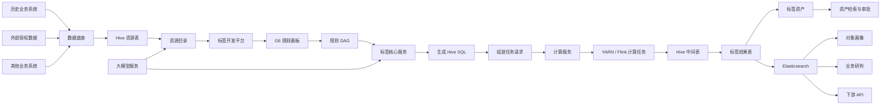
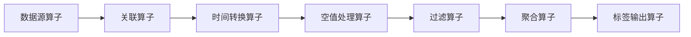
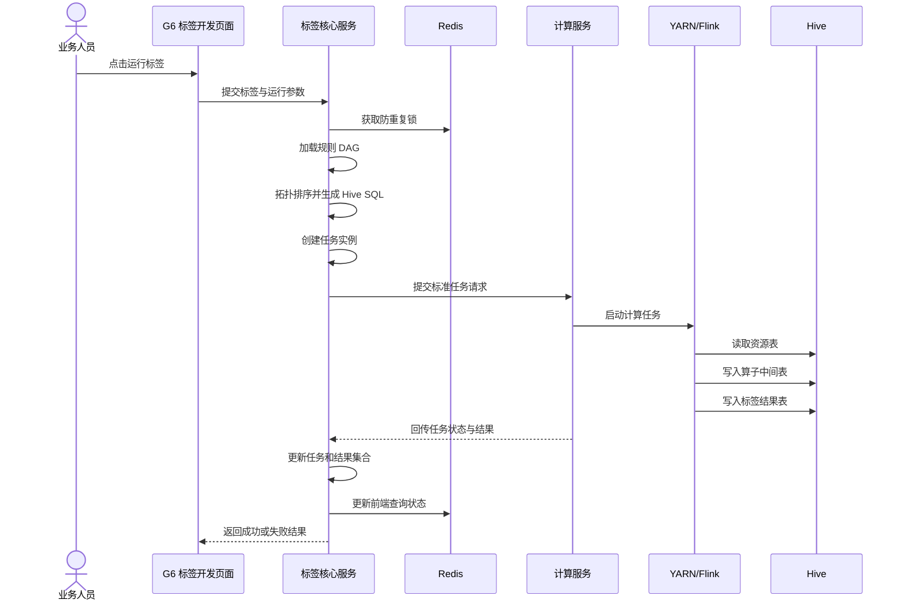
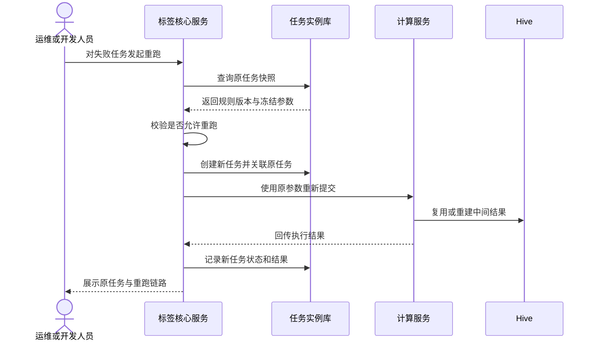
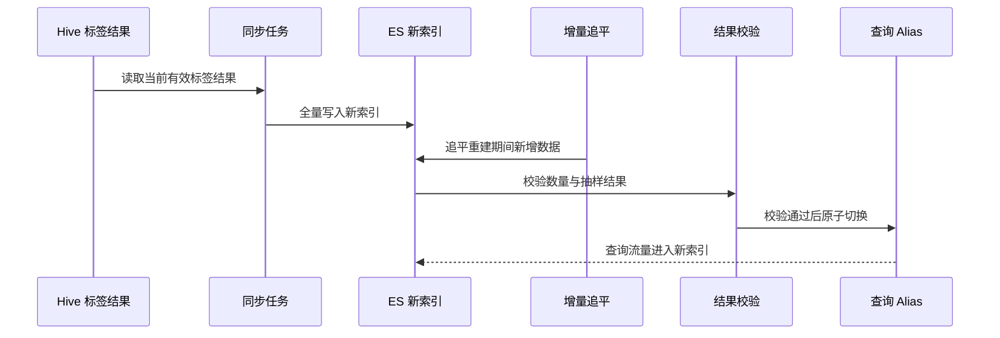

# 大数据资产管理平台

> 本文为公开展示版，项目名称、业务数据和部署规模均已做泛化处理。

## 0. 项目概览

这是一个面向政企数据治理场景的数据资产与标签管理平台，主要解决数据资源难查找、标签规则开发门槛高、离线任务难追踪，以及标签结果难以统一管理和查询的问题。

### 我的主要职责

- 参与标签核心服务及其内部资源目录、标签开发、标签资产和标签查询等模块建设。
- 参与规则 DAG 解析、Hive SQL 生成和标签任务编排。
- 参与任务状态跟踪、失败重跑、结果追溯和防重复提交设计。
- 参与 Hive 标签结果同步 Elasticsearch，以及索引重建和 Alias 切换方案。
- 参与 AI 助手、自然语言转 SQL、资源推荐和工具调用能力设计。

平台后端按照职责拆分为标签核心服务、计算服务和大模型服务三个微服务。本文重点介绍我实际参与和深入理解的业务链路。

### 核心技术栈

| 分类 | 技术 |
|---|---|
| 后端 | Java、Spring Boot、MyBatis |
| 数据与缓存 | MySQL、Redis、Hive |
| 大数据计算 | YARN、Flink |
| 搜索与消息 | Elasticsearch、Kafka |
| 前端编排 | AntV G6 |
| AI 应用 | RAG、Milvus、自然语言转 SQL、MCP 工具调用 |

## 1. 项目是做什么的

政企业务系统长期运行后，会沉淀大量来源不同、结构不同的数据。

这些数据可能来自历史业务系统，也可能来自外部授权接入的数据。数据进入数据底座后，通常以 Hive 表的形式存在，但业务人员仍然面临几个问题：

- 数据分散在不同资源表中，不清楚应该使用哪张表。
- 建设一个标签需要编写复杂 SQL，业务人员无法直接完成。
- 标签任务运行时间长，失败后难以定位和重跑。
- 标签虽然生成了，但缺少统一的分类、审批、发布和查询方式。
- 数据量较大，标签如何稳定写入 Elasticsearch 并持续更新是一个难题。

**该平台的作用，是把分散的数据资源转化为可开发、可运行、可管理、可查询的标签资产。**

平台采用多环境独立部署模式，单套环境可接入数百张 Hive 资源表，维护数百个标签，并支持多个标签任务和算子任务并行运行，部分任务需要处理亿级数据。

## 2. 一句话理解平台

如果只用一句话介绍：

> 平台通过资源目录管理 Hive 数据，使用 G6 画板编排标签规则，将规则 DAG 转换为 Hive SQL 和计算任务，再把运行结果注册为标签资产，供画像查询、业务研判和下游系统使用。

## 3. 先看整体架构

这张图先回答一个问题：一条原始数据最终是怎样变成可查询标签的？



平台不是一个单纯的标签查询系统，而是一条完整的标签生产链路：

```text
数据接入 -> 资源目录 -> 规则开发 -> 任务运行 -> 结果校验
-> 标签注册 -> 资产发布 -> ES 查询 -> 业务应用
```

## 4. 三个微服务及内部模块

平台后端由三个微服务组成：

| 微服务 | 主要职责 |
|---|---|
| 标签核心服务 | 承载资源目录、标签开发、任务编排、标签资产、标签查询、审批和审计等核心业务 |
| 计算服务 | 接收标签核心服务提交的任务，申请计算资源，执行 YARN/Flink 作业并回传状态 |
| 大模型服务 | 提供 RAG 助手、资源推荐、自然语言转 SQL、MCP 工具调用和 AI 任务治理 |

标签核心服务内部继续按照业务能力划分模块，但这些模块并不是独立微服务：

| 模块 | 主要职责 |
|---|---|
| 资源目录 | 管理 Hive 表、字段、数据来源、分类、权限和数据说明 |
| 标签开发平台 | 使用 G6 画板编排算子、字段、条件和上下游关系 |
| 规则与任务编排 | 保存规则、解析 DAG、生成 Hive SQL、组装任务、跟踪结果 |
| 中间表体系 | 保存各算子运行结果，支撑预览、排查、重跑和数据追踪 |
| 标签资产中心 | 管理标签分类、版本、审批、发布、上下线和使用说明 |
| 标签查询模块 | 将标签结果写入 ES，对外提供画像筛选和标准 API |
| 审批与审计 | 管理资源权限、标签发布审批和敏感数据访问日志 |

其中最核心的是两条主线：

1. **规则 DAG 如何变成可执行任务。**
2. **任务失败后如何重跑，并证明结果来自哪次运行。**

## 5. 资源目录：平台的数据入口

资源目录不是简单展示表名，而是对数据底座中的 Hive 表进行业务化整理。

一项资源通常需要记录：

- 数据来自哪个系统。
- 对应哪张 Hive 表。
- 表中有哪些字段。
- 字段的业务含义是什么。
- 数据按什么字段分区。
- 数据多久更新一次。
- 哪些人员或组织可以访问。
- 是否包含敏感字段。

业务人员开发标签时，不需要直接在大量 Hive 表中查找数据，而是先通过资源目录找到合适的数据资源，再把资源拖入标签规则画板。

资源目录解决的是“**数据在哪里、数据是什么意思、我有没有权限使用**”的问题。

## 6. 标签开发：从 G6 画板到规则 DAG

标签开发平台使用 AntV G6 构建可视化画板。

业务人员通过拖拽节点完成标签规则，例如：

```text
选择人员资源表
-> 关联行为记录表
-> 过滤近 30 天数据
-> 排除空业务标识
-> 按人员聚合次数
-> 筛选次数大于 5
-> 输出目标标签
```

画板中的节点对应算子，边表示算子的上下游关系。保存规则时，平台会分别保存：

- 算子节点及参数。
- 节点之间的边关系。
- 输入表和输入字段。
- 输出字段及字段别名。
- 画板坐标。
- 当前规则版本快照。

标签核心服务会把画板转换为 DAG，并进行拓扑排序、环路校验、字段校验和上下游依赖校验。



算子不限于过滤、时间转换和空值处理。实际平台还可以包含数据源、字段选择、关联、去重、聚合、排序、分组、类型转换、表达式计算和标签输出等算子。

## 7. 标签任务是怎样运行的

标签核心服务负责“把规则组装成任务”，计算服务负责“真正执行任务”。

下面这张时序图展示了一次完整运行。



标签核心服务不直接运行 YARN/Flink 作业，而是负责：

- 冻结本次运行使用的规则版本。
- 解析“当前天”“本月”等动态分区参数。
- 为本次运行生成唯一任务标识。
- 按 DAG 顺序生成各算子的 SQL。
- 记录任务状态、中间表、执行结果和失败原因。
- 接收计算服务回调并更新任务状态。

这种拆分让标签业务和底层计算资源保持相对独立。

## 8. 为什么每个算子都要落中间表

每个算子运行后都会把结果写入 Hive 中间表。

这会增加一定存储和表管理成本，但能解决几个关键问题：

- **单步预览**：业务人员可以查看当前算子的结果是否正确。
- **问题定位**：可以判断错误从哪个算子开始出现。
- **失败重跑**：上游结果未变化时，可以从指定节点继续执行。
- **数据追踪**：能够说明最终标签由哪些资源、规则和中间结果生成。
- **结果证明**：审批和审计时可以追溯本次任务的运行依据。

中间表必须绑定任务实例，表名中通常包含算子标识、序列号或任务标识。平台还要负责表的创建、引用、过期清理和异常任务残留表治理。

## 9. 预览、运行和重跑有什么区别

| 操作 | 目的 | 数据范围 | 是否形成正式标签 |
|---|---|---:|---|
| 单步预览 | 验证当前算子配置 | 最多返回少量样例数据 | 否 |
| 标签运行 | 生成正式标签结果 | 全量或指定分区 | 是 |
| 人工重跑 | 修复一次失败任务 | 使用冻结后的原参数 | 视结果校验而定 |
| 补偿运行 | 补齐漏跑批次 | 指定业务日期或分区 | 是 |

预览时，平台从 Hive 查询少量结果，并缓存到 Redis，前端再分页展示。Redis 只保存预览结果，不替代 Hive 作为正式数据存储。

重跑时不能简单“再点一次”。平台需要保留原任务的规则版本、分区参数和输入资源，新的重跑任务通过 `parentTaskId` 关联原任务。

下面是失败重跑的基本过程。



重跑的关键不是“重新执行”，而是**重新执行后仍然能够证明跑的是哪套规则、哪个分区和哪批数据**。

## 10. 从标签开发到标签资产

标签在开发平台中完成规则配置和运行，并不代表已经可以被下游使用。

只有经过校验和审批后，标签才会注册到标签资产中心。

标签资产可以按照业务对象划分为六大类：

| 分类 | 示例 |
|---|---|
| 人 | 用户类型、活跃用户、重点关注对象 |
| 事件 | 事件类型、事件等级、关联事件 |
| 行为 | 活跃行为、异常行为、业务行为 |
| 物 | 车辆、设备、物品及其他对象 |
| 地 | 重点场所、活动区域、业务区域 |
| 组织 | 企业、机构及关联组织 |

标签资产中心负责管理标签名称、编码、口径、分类、数据类型、负责人、版本、审批状态、发布时间、使用范围和下游依赖。

这一步把“能跑的规则”变成“能被理解和复用的数据资产”。

## 11. 标签结果为什么要写入 Elasticsearch

Hive 适合离线计算，但不适合直接支撑业务人员进行组合筛选和实时画像查询。

因此，正式标签结果会写入 Elasticsearch，为画像查人、条件筛选和下游 API 提供查询能力。

对象类文档可以采用“一对象一文档，标签为数组”的方式组织。实际项目中索引规模达到亿级，单条文档大小控制在 KB 以内。

当一个标签已经下线时，旧 ES 文档中可能仍然残留该标签。平台采用全量重建新索引、增量追平、结果校验和 Alias 原子切换的方式处理标签消亡问题，而不是对亿级文档逐条执行删除更新。



## 12. 大模型服务做什么

平台把 AI 能力拆成独立服务，避免模型逻辑直接侵入标签核心服务。

以下能力处于持续建设和验证阶段，具体上线范围以实际部署版本为准。

### 12.1 平台使用助手

将平台手册、算子说明和资源描述向量化写入 Milvus，通过 RAG 回答平台使用问题。

### 12.2 自然语言转 SQL

用户提供业务描述后，模型结合已选择的 Hive 表、字段和字段说明生成 SQL。

生成过程需要增加：

- Schema 范围约束。
- 只读 SQL 限制。
- 敏感字段权限校验。
- SQL 预览和人工确认。

### 12.3 资源推荐

用户输入业务场景后，模型推荐适合的资源表、字段和已有标签。没有权限的资源只能展示说明，并引导用户发起审批。

### 12.4 MCP 工具调用

资源查询、字段查询、权限校验、规则读取、页面导航和审批发起被封装为 MCP Tools。

模型不能直接操作数据库，而是通过受控工具访问平台能力。

### 12.5 AI 任务治理

使用 Redis 控制全局模型任务并发，超过并发上限后进入有限长度的等待队列；关键调用通过 Kafka 记录审计日志。

## 13. 业务如何使用标签

平台最终不是为了生产更多标签，而是为了帮助业务人员更快地找到信息和形成判断。

典型场景包括：

- **对象画像**：根据地区、行为、关系和业务标签组合筛选目标对象。
- **业务研判**：通过对象、事件、地点和组织标签发现关联信息。
- **重点对象管理**：按照标签变化识别新增、升级或退出的重点对象。
- **区域分析**：观察某类对象或事件在时间和空间上的分布。
- **关联分析**：根据共同对象、地点、设备或组织标签寻找业务关系。
- **下游服务调用**：通过标准 API 为其他系统提供授权范围内的标签数据。

标签只提供辅助信息，业务研判仍然需要结合原始数据、规则口径和人工判断。

## 14. 平台怎样保证可运行、可维护、可重跑

| 目标 | 主要设计 |
|---|---|
| 可运行 | DAG 校验、SQL 生成、任务实例、独立计算服务 |
| 可预览 | 单步调试、Hive 样例查询、Redis 预览缓存 |
| 可维护 | 规则版本、算子配置、资源目录和统一元数据 |
| 可重跑 | 参数冻结、任务快照、父子任务关系和中间表 |
| 可追踪 | 任务状态、规则版本、输入资源、SQL、中间表和结果集合 |
| 防重复 | 前端禁用、Redisson 锁、运行状态校验和数据库唯一约束 |
| 可审计 | 敏感访问日志、审批记录、Kafka 异步审计 |
| 可查询 | ES 标签索引、Alias 切换和标准标签 API |
| AI 可控 | MCP 工具边界、权限校验、人工确认、并发限制和审计 |

## 15. 技术架构中的职责边界

平台后端由三个微服务组成。标签核心服务承载完整的标签业务，计算服务负责底层任务执行，大模型服务提供独立的 AI 能力。

实际职责边界如下：

### 标签核心服务负责

- 标签、规则、算子和边关系管理。
- DAG 解析与校验。
- Hive SQL 生成。
- 任务请求组装。
- 任务状态和结果追踪。
- 资产注册、审批和发布。
- Hive 结果同步 Elasticsearch。
- 对象画像筛选和标准查询 API。
- 资源权限与操作审计。

### 计算服务负责

- 任务拆分。
- 计算资源申请。
- YARN/Flink 作业提交。
- 运行状态采集。
- 计算异常处理。

### 大模型服务负责

- 模型接入和提示词模板。
- RAG 知识库。
- 自然语言转 SQL。
- 资源推荐。
- MCP 工具调用。
- 会话、并发和审计治理。

三个服务之间的关系是：标签核心服务发起和管理业务任务，计算服务执行具体作业并回传状态，大模型服务通过标签核心服务提供的受控接口访问平台能力。

## 16. 项目的主要难点

这个项目真正有难度的地方，不是做几个增删改查页面，而是以下几个问题：

1. **如何把可视化画板稳定转换为可执行 DAG 和 Hive SQL。**
2. **如何管理长时间运行的标签任务，并支持失败重跑。**
3. **如何通过中间表和任务实例证明标签结果的来源。**
4. **如何处理全量、增量、分区参数和补偿任务。**
5. **如何清理 ES 中已经失效的标签，同时不丢失重建期间的新数据。**
6. **如何在资源权限、审批和审计约束下提供标签查询能力。**
7. **如何让 AI 调用平台能力，但不能绕过权限直接操作正式数据。**

这些问题共同决定了平台是不是一个真正可运行、可维护的平台。

## 17. 项目收获

通过这个项目，我形成了从规则开发、离线任务编排、结果追溯到标签资产发布的完整认识，并积累了以下实践经验：

- 使用 DAG 描述复杂业务规则，并将其转换为可执行 SQL。
- 通过任务快照、父子任务和中间表支持失败恢复与结果追溯。
- 在 Hive 离线计算与 Elasticsearch 在线查询之间设计数据同步链路。
- 使用 Redis、数据库约束和状态校验控制重复提交与并发任务。
- 在 AI 应用中设置权限、审计、人工确认和工具调用边界。

项目的核心价值不是简单堆叠技术组件，而是让标签生产过程做到可开发、可运行、可追踪和可治理。
