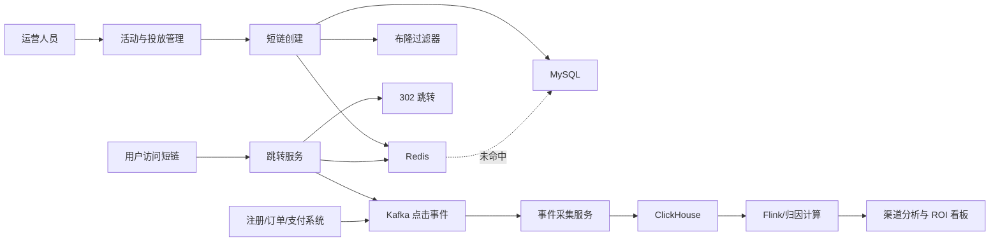
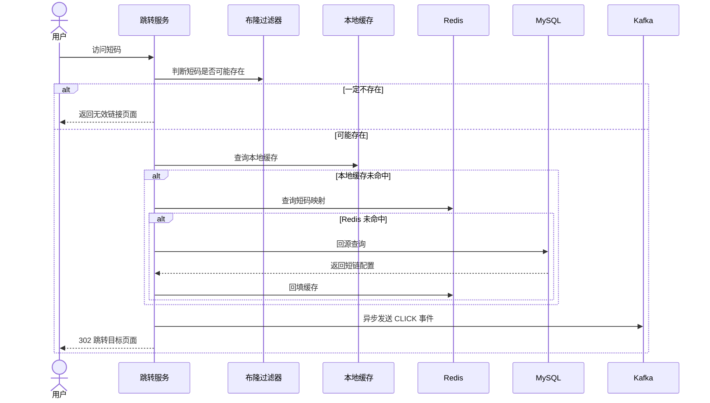
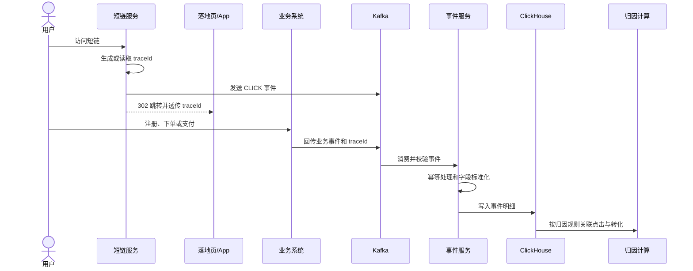

# 营销短链与投放归因平台

> 本文为脱敏后的面试项目介绍，不包含真实客户、域名、业务数据、内部接口和生产配置。

## 1. 项目概览

营销短链与投放归因平台面向短信营销、私域社群、渠道投放、KOL/KOC、地推物料和 App 拉新等场景。

平台不仅提供短链生成和 302 跳转，还会把活动、渠道、批次、物料与点击、注册、下单、支付等事件关联起来，为运营提供渠道转化分析和 ROI 复盘能力。

一句话概括：

> 平台以短链作为营销流量入口，通过低延迟跳转承接访问，异步采集点击和转化事件，并按照统一规则完成渠道归因和投放效果分析。

## 2. 我的职责

我在项目中主要负责短链数据采集和转化归因相关后端功能，具体包括：

- 参与点击、落地、注册、下单和支付等标准事件模型设计。
- 负责点击事件采集和业务转化事件回传接口。
- 设计 `eventId`、`traceId`、活动、渠道、批次和物料等归因字段。
- 处理接口重试、Kafka 重投导致的重复事件，保证事件消费幂等。
- 参与点击到注册、下单、支付的归因链路设计。
- 向下游数据计算服务提供标准事件数据和归因上下文。
- 参与短链跳转缓存、异常访问识别和稳定性方案讨论。

短码生成、302 跳转和缓存治理属于短链后端核心链路；Flink 数仓加工、指标汇总和正式 ROI 报表由下游数据计算服务负责。

## 3. 核心技术栈

| 分类 | 技术 |
|---|---|
| 后端 | Java、Spring Boot、MyBatis |
| 数据存储 | MySQL、ClickHouse |
| 缓存 | Redis、本地缓存、布隆过滤器 |
| 消息与计算 | Kafka、Flink |
| 网关与协议 | Nginx、HTTP 302 |
| 核心方案 | Base62、MurmurHash、事件幂等、营销归因 |

## 4. 整体架构

平台可以分为在线跳转链路和数据归因链路。



- **在线链路**优先保证低延迟和高可用，统计逻辑不能阻塞 302 跳转。
- **数据链路**优先保证事件完整、幂等、可追溯和归因口径一致。

## 5. 核心业务模型

短链不能只保存 `shortCode` 和 `originUrl`，否则只能统计访问次数，无法回答流量来自哪里。

项目将一次投放建模为：

```text
营销活动 -> 投放渠道 -> 投放批次 -> 推广物料
-> 外部推广标识 -> 短链 -> 点击事件 -> 转化事件
```

每条短链都绑定明确的投放上下文。同一个原始页面可以针对不同渠道、批次和物料生成不同短链，从而区分各自带来的点击和转化。

## 6. 短链创建与短码生成

短链创建时，平台会校验原始链接、域名、有效期和投放信息，再生成短码并保存映射关系。

短码生成方案为：

```text
唯一序列
-> MurmurHash 计算路由基因
-> 组合短码生成要素
-> Base62 编码
-> MySQL 唯一索引兜底
```

这里的设计取舍是：

- 唯一序列提供稳定且不重复的输入。
- MurmurHash 主要用于数据分布和路由基因，不负责最终唯一性。
- Base62 使用数字和大小写字母缩短编码长度。
- 数据库唯一索引处理极端冲突，避免只依赖哈希概率。

创建成功后，平台会把短码加入布隆过滤器并预热 Redis，减少首次访问的数据库回源。

## 7. 低延迟跳转链路

用户访问短链时，系统要尽快完成 302 跳转。



核心原则是：

- 查询路径采用本地缓存、Redis、MySQL 三级结构。
- 布隆过滤器和空值缓存拦截不存在短码的恶意扫描。
- 点击事件异步发送，不能同步写统计库后再跳转。
- 使用 302 而不是永久重定向，便于处理链接变更、禁用、过期和访问统计。

## 8. 点击与转化事件如何串联

用户完成 302 跳转后，注册、下单和支付发生在其他业务系统中，不能依靠支付系统再次访问短链。

项目通过 `traceId` 或归因标识串联整个转化过程：



统一事件类型包括：

```text
CLICK -> LANDING -> REGISTER -> ORDER -> PAY
```

每个事件都必须携带唯一的 `eventId`。消费端通过唯一约束或幂等记录处理接口重试、Kafka 重投和上游重复回传，避免同一笔转化被重复统计。

## 9. 归因规则设计

归因不是简单地把支付事件关联到最近一条点击记录，还要明确归因标识、匹配条件和时间窗口。

常见规则包括：

- 首次有效点击归因。
- 最近一次有效点击归因。
- 指定时间窗口内的点击归因。
- 指定活动或渠道优先归因。

项目将归因规则版本化，并在统计结果中记录规则和时间窗口，避免运营、渠道和财务采用不同口径后出现结果不一致。

职责边界上，短链后端负责事件模型、数据采集和归因字段；下游计算服务负责数据清洗、宽表构建、指标汇总和 ROI 报表。

## 10. Redis 与缓存治理

Redis 保存跳转所需的完整信息：

```text
shortCode -> originUrl + status + expireTime
             + campaignId + channelId
```

主要治理问题包括：

| 问题 | 处理方案 |
|---|---|
| 缓存穿透 | 布隆过滤器、空值缓存、短码格式校验 |
| 热 Key | 本地缓存、热点预热、Redis 集群、来源限频 |
| 缓存不一致 | 更新数据库后删除缓存，并通知各实例清理本地缓存 |
| Redis 故障 | 本地缓存兜底、数据库限流回源、超时和降级 |

短链禁用、过期或修改目标地址时，不能只等待 TTL 自然失效，否则旧链接可能继续跳转。

## 11. 异常访问治理

短链平台需要识别爬虫、恶意扫描和刷量，但这不等于单独建设完整风控平台。

判断依据包括：

- 单个 IP 在短时间扫描大量短码。
- 同一 IP 或设备高频访问同一短链。
- User-Agent 缺失或明显属于自动化工具。
- 请求间隔高度规律。
- 只有点击事件，没有正常落地和转化行为。

处理时区分“是否允许跳转”和“是否计入有效流量”：

| 风险等级 | 处理方式 |
|---|---|
| 低风险 | 正常跳转，标记为可疑点击 |
| 中风险 | 允许跳转，但不计入有效点击和归因 |
| 高风险 | 限流、风险提示或拒绝访问 |

这样可以降低误伤真实用户的风险，同时避免异常流量污染 ROI 数据。

## 12. 稳定性治理

平台优先保护 302 跳转主链路。

| 风险 | 治理方式 |
|---|---|
| 热点短链突发流量 | 本地缓存、热点预热、限频 |
| Redis 不可用 | 超时、熔断、本地缓存和限流回源 |
| 无效短码扫描 | 布隆过滤器、空值缓存、网关限流 |
| Kafka 发送失败 | 发送重试、失败告警和补偿机制 |
| Kafka 消费积压 | 消费者扩容、积压监控、批量消费 |
| 重复转化事件 | `eventId` 幂等校验 |
| ClickHouse 写入失败 | 批量重试、失败队列和补偿任务 |
| 缓存数据不一致 | 数据库更新后主动失效多级缓存 |

重点监控指标包括：

- 302 请求量、成功率和响应时间。
- 本地缓存与 Redis 命中率。
- MySQL 回源比例。
- 热点短码和无效短码请求量。
- Kafka 发送失败和消费积压。
- ClickHouse 写入延迟。
- 点击到转化的事件缺失率。

## 13. 项目难点与方案取舍

### 13.1 为什么统计必须异步

如果在 302 主链路同步写 Kafka、ClickHouse 或执行归因计算，下游抖动会直接影响用户跳转。因此主链路只完成必要校验、映射查询和事件投递，复杂统计全部异步处理。

### 13.2 为什么不能只统计 PV

浏览器预览、爬虫和重复刷新都会产生点击。项目区分原始点击、有效点击、可疑点击和转化点击，ROI 与渠道结算优先使用有效点击及真实转化数据。

### 13.3 为什么不用 MySQL 保存所有点击明细

MySQL 负责短链配置、活动关系和生命周期等事务数据。点击和转化事件持续追加且需要多维聚合，更适合写入 ClickHouse，并由 Flink 完成后续数据加工。

### 13.4 为什么不一开始就分库分表

分库分表会增加路由、扩容、事务和运维成本。项目先通过 MySQL、Redis 和合理索引满足需求，达到明确容量瓶颈后再根据短码中的稳定路由基因进行拆分。

## 14. 项目亮点

1. 短码方案兼顾唯一性、编码长度和未来分片路由能力。
2. 302 跳转与点击统计解耦，避免数据链路影响用户访问。
3. 多级缓存、布隆过滤器和空值缓存共同保护数据库。
4. 通过统一事件模型和 `traceId` 串联点击到支付的完整漏斗。
5. 通过 `eventId` 幂等处理重复回传和消息重投。
6. 归因规则版本化，保证不同部门使用统一统计口径。
7. 将原始点击和有效点击分离，减少异常流量对 ROI 的污染。